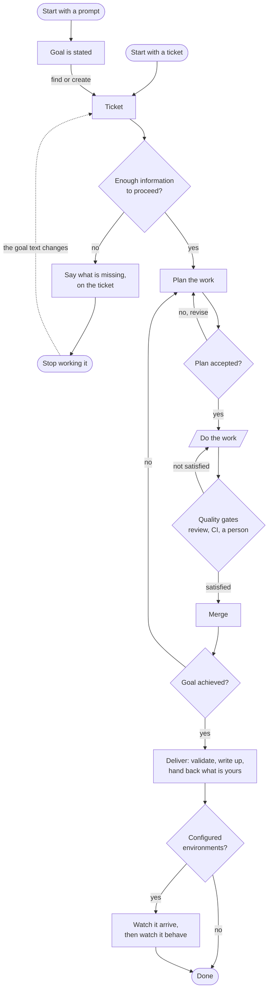

# LubbDubb

A self-hosted, always-running **orchestration harness** for one software engineer's work — a
_cockpit_ that watches your inputs (issues, PRs, CI, review comments), decides what to do on a
heartbeat, and dispatches Claude Code agents to do it, escalating to you only what genuinely needs
judgment.

The name is the heartbeat: the server's core is a periodic pulse that drives everything.

> **Where to read what.** This file is the overview: what the harness does, how work flows through
> it, and the configuration that matters on day one. [`docs/workflow.md`](docs/workflow.md) is the
> workflow in full, including where a different one slots in. [`docs/spec/`](docs/README.md) is the
> specification of how every part of the application behaves today, written as fact — every config
> key, every dispatch rule, the agent runtimes, the API, the cockpit. If you want the detail behind
> anything below, it is in there. [`docs/feature-timeline.md`](docs/feature-timeline.md) is how it
> got this way.

---

## The pulse

One repeating cycle, driven by a heartbeat (`heartbeatIntervalMs`, default 30s while the fleet is
busy; `idleHeartbeatIntervalMs`, 5 minutes, while it is not) and also
triggerable on demand:

```
snapshot the world  →  diff against the last snapshot  →  reconcile plans
      →  decide (dispatcher)  →  execute (executor)  →  audit
```

Every step is recorded. The dispatcher's rationale, every action it emitted, and the outcome of each
action are persisted — so an idle cycle is as explainable as a busy one. Agents run in pooled git
worktrees (code work) or scratch dirs (desk work), and report back over a typed tool channel.

## What it does

Grouped by where in the loop it sits. Each line links to the spec that owns it.

### Taking work in

| Feature                | What it is                                                                                                                                   |
| ---------------------- | -------------------------------------------------------------------------------------------------------------------------------------------- |
| **Opt-in watching**    | One `${labelPrefix}-watch` tag decides what is acted on, on issues and pull requests alike. Nothing outside it is touched. → [06][s06]       |
| **Two providers**      | GitHub and Azure DevOps behind per-capability seams, plus a `fake` provider the whole suite and the demo run on. → [15][s15]                 |
| **Tracker states**     | Where the provider has workflow states, pickup is gated on them and the harness moves the item to in-progress and in-review. → [06][s06]     |
| **Priority and order** | Priority labels weight pickup; the ranked plan ships as **Up next** with a cut-line at current headroom, re-orderable by you. → [05][s05]    |
| **Tickets board**      | Every open and closed item, as a table or a column-per-state board you drag cards across — the drop's cost said before it lands. → [17][s17] |
| **Attachments**        | Images attached to a brief follow the issue to whichever agent works it, stored outside every worktree. → [12][s12]                          |

### Deciding

| Feature                  | What it is                                                                                                                                          |
| ------------------------ | --------------------------------------------------------------------------------------------------------------------------------------------------- |
| **A rule pipeline**      | Two dozen named rules walked in a declared order, each proposing work from the world. The order is data, not numbers on a comment. → [05][s05]      |
| **A bounded vocabulary** | The dispatcher can only ever ask for one of eleven validated actions; anything malformed is rejected and audited, never executed. → [05][s05]       |
| **Per-check CI policy**  | What to do about _which_ check went red — fix it, fix it with guidance, hold it because it is not ours, or escalate once. → [02][s02]               |
| **The decision log**     | Executed, deferred, rejected and skipped alike, each with its reason and the rule that produced it, expandable to why that rule exists. → [18][s18] |
| **Cooldowns and caps**   | Per-origin attempt caps and cooldowns, so a dispatch that keeps failing escalates instead of looping. → [05][s05]                                   |

### Doing the work

| Feature                   | What it is                                                                                                                                     |
| ------------------------- | ---------------------------------------------------------------------------------------------------------------------------------------------- |
| **Agents in worktrees**   | A bounded pool of checkouts leased to branches and switched rather than recreated, so a branch that comes back starts warm. → [09][s09]        |
| **A typed tool channel**  | An MCP server agents call back on — read the world, raise what they learned, open a pull request, report a check. → [11][s11]                  |
| **A permission backstop** | An agent hitting a command outside the allow-list asks you rather than hanging. → [11][s11]                                                    |
| **Models per rule**       | Named profiles — a model and the depth it runs at — assigned per dispatch rule, so a conflict fix and a plan are not priced alike. → [02][s02] |
| **Jobs and schedules**    | An ad-hoc prompt queued from the cockpit, or queued for you on a cron expression. Both wait for a slot like everything else. → [13][s13]       |
| **Crash recovery**        | Agents orphaned by a restart are parked, and the pulse is held, until you restore, requeue or remove each one. → [10][s10]                     |
| **Live transcripts**      | Click an agent and read what it is doing, type into it, and see what it produced mid-run. → [10][s10], [12][s12]                               |

### Pull requests

| Feature                | What it is                                                                                                                                           |
| ---------------------- | ---------------------------------------------------------------------------------------------------------------------------------------------------- |
| **Health predicates**  | Failing CI, behind or conflicting with its base, unhandled review threads, ready to merge — one agent per branch, top concern first. → [07][s07]     |
| **The fleet review**   | Off by default: the harness reads a pull request of its own before a person is asked, with a triage that picks how thoroughly. → [07][s07]           |
| **Answering a review** | Every unhandled thread goes to one agent, replied to through the harness — signed, recorded, and resolved on the provider's own threads. → [07][s07] |
| **Stacks**             | A part is based on the part it depends on; a red base is attributed to the PR that owns it, and merging is bottom-up. → [07][s07]                    |
| **Waiting on you**     | A pull request somebody assigned you, who asked, and how long it has been sitting there. → [17][s17]                                                 |

### The funnel, per goal

| Feature            | What it is                                                                                                                                                |
| ------------------ | --------------------------------------------------------------------------------------------------------------------------------------------------------- |
| **Goal appraisal** | Is there a goal here to work from? A refusal says what is missing, on the ticket, and lifts when the goal text changes. → [08][s08]                       |
| **Planning**       | One pull request, or a dependency-chained decomposition into parts each with its own branch and scope — or "this is already done". → [08][s08]            |
| **Plan approval**  | Always. A plan carries risks, scope-outs and how anyone will know it worked, and can be discussed with a conversational planner. → [08][s08]              |
| **Assessment**     | Asked of what was delivered, not of the agent's confidence. Its `no` arm replans, adds a part, or escalates. → [08][s08]                                  |
| **Validation**     | Checks that can only be answered by running the delivered thing, written for a person — or handed to your own Claude Code. → [20][s20]                    |
| **Retrospective**  | One write-up per delivered goal, from the shared scratchpad and the harness's own record of what it cost. → [13][s13]                                     |
| **Close-out**      | The harness never closes a ticket. It files a standing obligation with your name on it, which settles once the tracker stops listing it open. → [13][s13] |

### After it lands

| Feature                  | What it is                                                                                                                                         |
| ------------------------ | -------------------------------------------------------------------------------------------------------------------------------------------------- |
| **Environments**         | Off by default. The commit each PR landed as, and whether each environment has it yet — asked with your own command, three-valued. → [24][s24]     |
| **Arrivals**             | Arriving somewhere can be what opens what a delivered goal owes you, and what puts a line on the ticket. Both opt-in, per environment. → [24][s24] |
| **Post-deploy watch**    | A goal declares what a running system must show; an arrival opens a window, and your telemetry is asked on a schedule. No model in it. → [29][s29] |
| **Knowledge**            | One claim store for everything the fleet learns, four distances a fact can carry, and one block of it in every agent's system prompt. → [27][s27]  |
| **The cross-fleet pool** | The distance above `fleet`: one namespace per fleet in a shared repository, with a corroboration model and a digest. → [28][s28]                   |

### Watching the harness itself

| Feature           | What it is                                                                                                                                        |
| ----------------- | ------------------------------------------------------------------------------------------------------------------------------------------------- |
| **Needs you**     | One rail: escalations, plan approvals, outbound proposals, permission requests, config health, and the obligations a delivery leaves. → [17][s17] |
| **Insights**      | What runs cost, what they yielded and what came out — plus a live burn watch that surfaces a run several times its bucket's median. → [18][s18]   |
| **The runway**    | Whether there is work left for the fleet, measured in fleet time — and whether the reason there is not is you. → [25][s25]                        |
| **Config health** | One row per setting that can stop the fleet silently, each ending in a check against the real world rather than advice. → [26][s26]               |
| **The error log** | The one path every caught failure funnels through: persisted, mirrored to stderr, streamed to the cockpit. → [18][s18]                            |
| **Self-update**   | The harness watches its own build, drains, and hands off to a supervisor that replaces it. → [21][s21]                                            |
| **Local runs**    | The machine's one dev environment, brought up and taken down from the cockpit, with its output in the pane the fleet already has. → [23][s23]     |
| **Pets**          | A vivarium at the foot of the rail. Your actions drop eggs; the eggs hatch. It gates nothing. → [22][s22]                                         |

## The flow of work

Two entry points, one path. A prompt states a goal and a ticket is found or created for it; a ticket
states its own. Everything downstream keys on the ticket, so work started from a prompt is as
recoverable, reviewable and reportable as work started from the tracker.



### The standard steps

| Step                    | What happens                                                                                                                                                         |
| ----------------------- | -------------------------------------------------------------------------------------------------------------------------------------------------------------------- |
| **Intake**              | Every open issue/PR is fetched and shown. What is _acted on_ is decided by the watch tag, plus tracker workflow states where the provider has them.                  |
| **Enough information?** | One agent reads the ticket against the repository and says whether there is a goal here to work from. Only an explicit `unclear` holds anything.                     |
| **Plan the work**       | A planning agent reads the repo and returns either _one PR will do_, a decomposition into dependency-chained parts, or _this goal is already met_.                   |
| **Plan accepted?**      | Every plan verdict appears in **Needs you**. Accepting releases the parts to be scheduled; rejecting falls the issue back to the single-PR path, and it can be held. |
| **Do the work**         | An agent per part (or one for the whole issue), each in its own worktree. Code is the most common arm, not the only one — a part may finish with a report.           |
| **Quality gates**       | The fleet's own review of the diff (opt-in), then tests, static analysis, pipeline health and human review. Each failing check is classified per check.              |
| **Merge**               | A green, approved, mergeable, comment-clear PR is merged — bottom-up for a stack, and never while it is based on another in-flight branch.                           |
| **Goal achieved?**      | Asked of what was actually delivered, not of the agent's confidence. A `no` returns to planning, because what is missing may be a different decomposition.           |
| **Deliver**             | A validation sheet of checks only a person or a running system can answer; a retrospective written from the record; the tracker state moved and a status comment.    |
| **Close out**           | Nothing closes the ticket. A standing obligation with your name on it is filed, and settles itself once the tracker stops listing the item open.                     |
| **Arrival**             | Where environments are configured: the commit each PR landed as, whether each environment has it yet, and — where declared — whether it is behaving now it is there. |

### The gates that carry the loop

Each is a decision something has to **make**, not a step that always passes.

- **Enough information to proceed** rejects a goal nothing can act on, before an agent spends itself
  discovering that. Refusal is not silent — it says what is missing, on the ticket — and it is not
  permanent: the hold ends when the goal text changes, or when anyone comments.
- **Plan accepted** is where you see the shape of the work before it happens. There is no switch for
  it: a plan that started itself can only be undone by a replan, which is strictly worse.
- **Quality gates** are a set, not a list — tests, static analysis, pipeline health, human review, and
  the fleet's own review where it is on. The classification is per check, and the third reading is
  the one that matters: _red, but not ours_ holds and says why, rather than sending an agent at a wall.
- **Goal achieved** is asked of the delivered work. Its `no` arm proposes a replan, a follow-up part,
  or escalates — depending on what the assessment says fell short.

### Priorities when headroom is scarce

The dispatcher ranks every candidate, then applies the concurrency cut. Roughly, highest first:

1. An operator queued a job from the cockpit — takes the next free slot.
2. A PR with problems: failing CI, a stale or conflicting base, an unhandled review comment.
3. A PR that is ready to merge.
4. Planning, approval, appraisal and assessment for issues.
5. Plan parts, then fresh issue pickup.

PR work runs _before_ new issue pickup, so a PR in trouble is always worked ahead of starting new
tickets. The full ordered plan ships to the cockpit as **Up next**, with a cut-line at the current
headroom; you can re-order it, and the override persists.

### Where you are in the loop

The harness owns the loop; you own the verdicts. You are asked when — and only when — a decision is
genuinely yours:

- **Needs you** collects escalations, plan approvals, outbound-act proposals, permission requests from
  agents that hit a command outside the allow-list, the config checks, and what a delivered goal still
  owes you — a validation sheet to run, a ticket to close.
- **Nothing side-effectful leaves without a human**, save two standing authorities that are yours: a
  stack landing you clicked over named pull requests, and `sendPrRepliesWithoutApproval`, on by
  default, which sends a drafted review reply straight to the thread. A rejection stands until the
  world gives a reason to ask again — a push, a CI result, an approval, a comment — and the reason you
  typed is handed to the next agent that works that item.
- **A restart never decides for you.** Agents orphaned by a crash or shutdown are parked, and the
  heartbeat is held until you restore, requeue or remove each one.

Two things are deliberately fixed: every act reaching the outside world is authorized, and an agent
**declares** that it finished — silence never reads as success.

## Getting started

Node **^20.19 || >=22.12** and git. A fresh clone installs with `npm ci` — `better-sqlite3` and
`node-pty` are native builds, so it is not instant.

```bash
npm ci                                               # native deps: better-sqlite3, node-pty
cp lubbdubb.config.example.json lubbdubb.config.json # your local config (gitignored)
npm start                                            # builds the cockpit, serves on 127.0.0.1:4300
```

Every key in the config is optional and the harness boots with no file at all — but the defaults
select the real Claude Code runtime, while the shipped example selects the mock one (`agentMode: "raw"`
against the built-in `fake` providers). So copy it for a first run and the whole loop turns with no
model or provider credentials. From then on the cockpit's **Config** page edits that same file
directly, key by key, leaving its comments and ordering alone — hand-editing and the form are two ways
at one file.

`npm start` builds the cockpit bundle and then runs the server. Two variants matter:
`npm run start:server` skips the build and serves whatever `web/dist` already holds, and
**`npm run serve`** runs the server under the supervisor that can replace it — which is what
self-update needs, and the way to run it under systemd, NSSM or a long-lived terminal.
→ [docs/spec/21](docs/spec/21-self-update.md#applying-it)

Boot prints what it decided, and the link to open:

```
[lubbdubb] cockpit listening on 127.0.0.1:4300
[lubbdubb] open the cockpit: http://127.0.0.1:4300/#t=<token>
[lubbdubb] token minted at .lubbdubb/cockpit-token (0600) — reused on the next start
[lubbdubb] heartbeat=300000ms cap=3
[lubbdubb] agent tools: on
```

Open it once per browser and the cockpit remembers the token. The harness binds **loopback only** and
every route needs that token, because the cockpit can queue a job — and a job spawns a real agent with
write access to your repo. The token file is gitignored, along with the rest of `.lubbdubb/` (the
SQLite database, worktrees, desk scratch dirs and attachments all live under it).

### The one manual step: the desktop validation channel

The harness also listens on a second MCP socket so **your own** Claude Code can take a validation
check the fleet would otherwise run unattended. It starts by itself, but Claude Code has to be told
about it **once** — boot prints the exact command, which is the only thing here you type by hand:

```
[lubbdubb] desktop validation channel on — register it in Claude Code once with:
[lubbdubb]   claude mcp add --scope user lubbdubb -- <node> <bridge> --desktop
[lubbdubb] credential at ~/.lubbdubb/desktop.json (0600), reminted every start
[lubbdubb] /lubbdubb skill installed at ~/.claude/skills/lubbdubb/SKILL.md
```

Copy the line as printed — the paths are resolved for your install. The credential is reminted every
start, so the registration keeps working; the `/lubbdubb` skill is rewritten alongside it. Skip this
and nothing breaks: every check simply falls to the fleet.
→ [docs/spec/20](docs/spec/20-validation.md#the-desktop-channel)

Then: use **Inject event** to simulate the world moving (a CI failure, a review comment) and watch the
harness react; click an agent to see its live transcript and type into it; answer items in **Needs
you**; use **New job** to launch an ad-hoc prompt, or **New schedule** to have one queued on a cron
expression (`0 9 * * 1-5` — weekdays at nine, read in the harness's own timezone). The **Decision log**
shows what was decided each cycle and which rule produced it; **Activity** shows how the world itself
changed.

**Needs you** also carries the configuration checks — one row per setting that can stop the fleet
silently, each ending in a check against the real world rather than a sentence of advice. On a fresh
install that rail is the shortest route from the mock loop to a working deployment.
→ [docs/spec/26](docs/spec/26-setup.md)

## Configuration

Every key is optional, and every key, its default and its precedence is in
[`docs/spec/02-configuration.md`](docs/spec/02-configuration.md). These are the ones that decide
whether a deployment works at all:

| Key                            | Default                     | Why it matters                                                                                                                                            |
| ------------------------------ | --------------------------- | --------------------------------------------------------------------------------------------------------------------------------------------------------- |
| `repoRoot`                     | the directory you launch in | The git repository worktrees are cut from. Left alone, the harness works on **its own** checkout.                                                         |
| `integrations`                 | all `fake`                  | Which provider serves each capability — `sourceControl`, `issues`, `pool`. `fake` is the mock world the demo and the suite run on.                        |
| `github` / `azureDevOps`       | unset                       | The provider's own target: owner and repo, or organization, project and repository.                                                                       |
| `userId`                       | unset                       | Who you are to the provider. **Pickup reads label authorship**, so without it nothing is ever picked up and nothing says why. → [06][s06]                 |
| `ownWorkOnly`                  | `true`                      | Whether the world arrives filtered to you: your watch tags, your pull requests. A team decision, so it belongs in the project layer.                      |
| `agentMode`                    | `stream`                    | `stream` runs a real model. `raw` is the mock agent — argv over a terminal — and what the example config and the tests use.                               |
| `maxConcurrentAgents`          | `3`                         | The fleet's **one** size knob: the worktree pool is this plus a slack of two, read live, so raising it raises the pool with it.                           |
| `defaultBranch`                | `"main"`                    | The integration branch. Not auto-detected, and a PR targeting anything else is treated as stacked.                                                        |
| `heartbeatIntervalMs`          | `30000`                     | The gap between timer-driven cycles while the fleet is busy; `idleHeartbeatIntervalMs` (5 min) while it is not. Everything is also triggerable on demand. |
| `labelPrefix`                  | `"lubbdubb"`                | Derives the one `-watch` tag. Everything is opt-in; an empty prefix turns the gate off entirely.                                                          |
| `ci.checks`                    | `[]`                        | Per-check policy: dispatch, dispatch with guidance, ignore, or escalate. Empty means every red check gets an agent. → [02][s02]                           |
| `agentModels`                  | unset                       | Named profiles — a model and the depth it runs at — assigned per dispatch rule. Omitted, no launch carries `--model`.                                     |
| `agentAllowedTools`            | npm/git/gh/node             | What an unattended agent may run without asking. Anything else is routed to you rather than hanging. **Never** set this via `claudeArgs`.                 |
| `sendPrRepliesWithoutApproval` | `true`                      | Send a drafted review reply straight to the thread. `false` is the stricter setting: every draft waits in the inbox.                                      |
| `review.enabled`               | `false`                     | The fleet reads a pull request of its own before a person is asked. With two or more `review.modes`, a triage picks how thoroughly.                       |
| `environments`                 | `[]`                        | Where landed work travels: a command per environment printing the commit it is at, optionally what an arrival opens and what to watch for.                |
| `host` / `port` / `auth`       | `127.0.0.1` / `4300` / on   | Loopback and a bearer token. A host reachable off this machine with `auth.enabled: false` is **refused at load**.                                         |

A first real deployment is about six lines:

```json
{
  "repoRoot": "/path/to/your/repo",
  "integrations": { "sourceControl": "github", "issues": "github" },
  "github": { "owner": "acme", "repo": "app" },
  "userId": "your-github-login",
  "agentMode": "stream",
  "maxConcurrentAgents": 3,
  "defaultBranch": "main"
}
```

**Secrets are never config keys.** `GITHUB_TOKEN` for GitHub, `AZURE_DEVOPS_PAT` (or a logged-in `az`
CLI) for Azure DevOps, `LUBBDUBB_TOKEN` for the cockpit — all from the environment, so
`lubbdubb.config.json` stays safe to paste. Agents inherit your shell's model credentials; a stray
`ANTHROPIC_API_KEY` silently moves the whole fleet onto API billing.

**Several switches no longer exist.** Planning, plan approval, the goal appraisal, the assessment, the
retrospective, validation, the tool channel and the permission backstop are all unconditional. A
config still naming one of them is warned about and ignored, and the warning says what replaced it.
→ [docs/spec/02](docs/spec/02-configuration.md#retired-keys)

### Sharing a config with your team

`lubbdubb.config.json` is yours and is gitignored. A **`lubbdubb.project.json` committed at the root of
the repository the harness works on** is the team's: everyone pointed at that repo picks it up, and
each person's own file wins over it key by key. So the CI routing, the environments, the integration
branch and the tracker's state names are written once in the project, while who you are (`userId`),
which models you dispatch on (`agentModels`) and how many agents your machine runs stay local. Every
key is legal in it except `repoRoot` — the file is found _through_ `repoRoot`, so it cannot be the
thing that sets it. → [docs/spec/02](docs/spec/02-configuration.md#the-project-layer)

## Development

```bash
npm run dev        # server with reload
npm run web:dev    # cockpit with HMR (proxies /api + /ws)
npm test           # unit + integration tests (node:test)
npm run smoke      # full end-to-end with real node-pty + a git worktree
npm run check      # format, lint, typecheck ×2, knip, test — concurrently, in one shot
```

`npm run check` is the gate CI enforces. It runs its stages in parallel and reports every failure
rather than stopping at the first; a warm run costs about as long as the test suite alone.

See [`docs/spec/19-development.md`](docs/spec/19-development.md) for the test seams, the coverage and
security workflows, and the hosted GitHub Pages demo build.

## Documentation

| Where                                                  | What it is                                                                     |
| ------------------------------------------------------ | ------------------------------------------------------------------------------ |
| [`docs/operating.md`](docs/operating.md)               | How to operate the harness: what changes about the job, and what stays yours   |
| [`docs/operating.html`](docs/operating.html)           | The same guide as a page to skim — open it in a browser                        |
| [`docs/workflow.md`](docs/workflow.md)                 | The end-to-end workflow, its variation points, and what is narrower than drawn |
| [`docs/spec/`](docs/README.md)                         | The specification of every subsystem as it behaves today                       |
| [`docs/feature-timeline.md`](docs/feature-timeline.md) | What landed when, from the walking skeleton onwards                            |
| [`docs/prompt-templates/`](docs/prompt-templates/)     | The rule dispatcher's built-in prompt bodies, ready to override                |
| [`CLAUDE.md`](CLAUDE.md)                               | Operating notes for agents working in this repo — the sharp edges              |

## License

[MIT](LICENSE). Copyright (c) 2026 Adam Awan.

[s02]: docs/spec/02-configuration.md
[s05]: docs/spec/05-dispatcher.md
[s06]: docs/spec/06-issue-pickup.md
[s07]: docs/spec/07-pull-requests.md
[s08]: docs/spec/08-planning.md
[s09]: docs/spec/09-execution.md
[s10]: docs/spec/10-agent-runtimes.md
[s11]: docs/spec/11-mcp-tools.md
[s12]: docs/spec/12-artifacts-and-files.md
[s13]: docs/spec/13-jobs-and-tickets.md
[s15]: docs/spec/15-integrations.md
[s17]: docs/spec/17-cockpit.md
[s18]: docs/spec/18-observability.md
[s20]: docs/spec/20-validation.md
[s21]: docs/spec/21-self-update.md
[s22]: docs/spec/22-pets.md
[s23]: docs/spec/23-local-runs.md
[s24]: docs/spec/24-environments.md
[s25]: docs/spec/25-supply.md
[s26]: docs/spec/26-setup.md
[s27]: docs/spec/27-knowledge.md
[s28]: docs/spec/28-cross-fleet-pool.md
[s29]: docs/spec/29-post-deploy-watch.md
