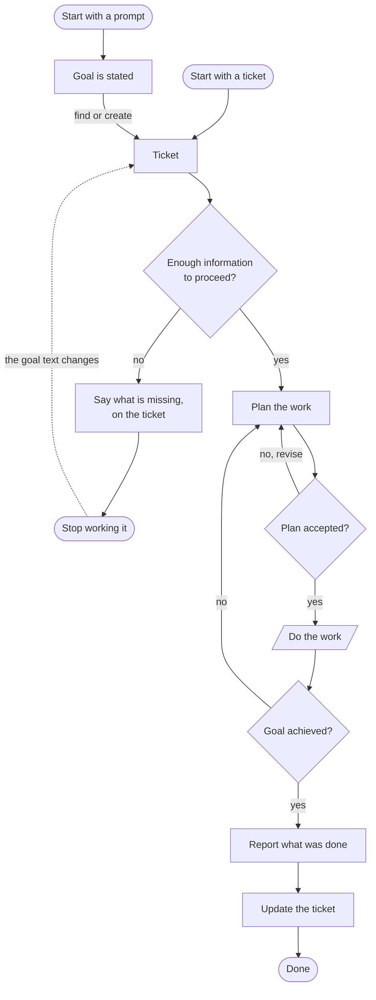

# LubbDubb

A self-hosted, always-running **orchestration harness** for one software engineer's work — a
_cockpit_ that watches your inputs (issues, PRs, CI, review comments), decides what to do on a
heartbeat, and dispatches Claude Code agents to do it, escalating to you only what genuinely needs
judgment.

The name is the heartbeat: the server's core is a periodic pulse that drives everything.

> **Where to read what.** This file is the overview and the shape of the work.
> [`docs/workflow.md`](docs/workflow.md) is the workflow in full, including where a different one
> slots in. [`docs/spec/`](docs/README.md) is the specification of how every part of the application
> behaves today, written as fact — configuration, dispatch rules, agent runtimes, the API, the
> cockpit. If you want the detail behind anything below, it is in there.

---

## The pulse

One repeating cycle, driven by a heartbeat (`heartbeatIntervalMs`, default 5 minutes) and also
triggerable on demand:

```
snapshot the world  →  diff against the last snapshot  →  reconcile plans
      →  decide (dispatcher)  →  execute (executor)  →  audit
```

Every step is recorded. The dispatcher's rationale, every action it emitted, and the outcome of each
action are persisted — so an idle cycle is as explainable as a busy one. Agents run in per-branch git
worktrees (code work) or scratch dirs (desk work), and report back over a typed tool channel.

## The flow of work

Two entry points, one path. A prompt states a goal and a ticket is found or created for it; a ticket
states its own. Everything downstream keys on the ticket, so work started from a prompt is as
recoverable, reviewable and reportable as work started from the tracker.



### The standard steps

| Step                         | What happens                                                                                                                                                     |
| ---------------------------- | ---------------------------------------------------------------------------------------------------------------------------------------------------------------- |
| **Intake**                   | Every open issue/PR is fetched and shown. What is _acted on_ is decided by the watch/ignore tags, plus tracker workflow states where the provider has them.      |
| **Enough information?**      | One agent reads the ticket against the repository and says whether there is a goal here to work from. Only an explicit `unclear` holds anything.                 |
| **Plan the work**            | A planning agent reads the repo and returns either _one PR will do_ or a decomposition into dependency-chained parts, each with its own branch and scope.        |
| **Plan accepted?**           | A decomposition appears in **Needs you** as accept/reject. Accepting releases the parts to be scheduled; rejecting falls the issue back to the single-PR path.   |
| **Do the work**              | An agent per part (or one for the whole issue), each in its own worktree. Code is the most common arm, not the only one — a part may finish with a report.       |
| **Quality gates**            | Tests, static analysis, pipeline health, human review. Each failing check is classified per check: fix it, fix it with latitude, or hold because it isn't ours.  |
| **Merge**                    | A green, approved, mergeable, comment-clear PR is merged — bottom-up for a stack, and never while it is based on another in-flight branch.                       |
| **Goal achieved?**           | Asked of what was actually delivered, not of the agent's confidence. A `no` returns to planning, because what is missing may be a different decomposition.       |
| **Report and ticket update** | A desk agent writes the run up from the shared scratchpad and the harness's own record. The tracker state moves and status comments are written; nothing closes. |

### Three gates carry the loop

Each is a decision something has to **make**, not a step that always passes.

- **Enough information to proceed** rejects a goal nothing can act on, before an agent spends itself
  discovering that. Refusal is not silent — it says what is missing, on the ticket — and it is not
  permanent: the hold ends when the goal text changes, or when anyone comments.
- **Plan accepted** is where you see the shape of the work before it happens.
- **Goal achieved** is asked of the delivered work. Its `no` arm proposes a replan, a follow-up part,
  or escalates — depending on what the assessment says fell short.

### Priorities when headroom is scarce

The dispatcher ranks every candidate, then applies the concurrency cut. Roughly, highest first:

1. An operator queued a job from the cockpit — takes the next free slot.
2. A PR with problems: failing CI, a stale or conflicting base, an unhandled review comment.
3. A PR that is ready to merge.
4. Planning, approval, assay and assessment for issues.
5. Plan parts, then fresh issue pickup.

PR work runs _before_ new issue pickup, so a PR in trouble is always worked ahead of starting new
tickets. The full ordered plan ships to the cockpit as **Up next**, with a cut-line at the current
headroom; you can re-order it, and the override persists.

### Where you are in the loop

The harness owns the loop; you own the verdicts. You are asked when — and only when — a decision is
genuinely yours:

- **Needs you** collects escalations, plan approvals, outbound-act proposals, and permission requests
  from agents that hit a command outside the allow-list.
- **Nothing side-effectful leaves without a human**, unless you opt a specific action into
  confidence-gated auto-send (off by default). A rejection stands until the world gives a reason to
  ask again — a push, a CI result, an approval, a comment — and the reason you typed is handed to the
  next agent that works that item.
- **A restart never decides for you.** Agents orphaned by a crash or shutdown are parked, and the
  heartbeat is held until you restore, requeue or remove each one.

Two things are deliberately fixed: every act reaching the outside world is authorized, and an agent
**declares** that it finished — silence never reads as success.

## Getting started

```bash
npm install                                          # builds native deps (better-sqlite3, node-pty)
cp lubbdubb.config.example.json lubbdubb.config.json # your local config (gitignored)
npm start                                            # builds the cockpit, serves on 127.0.0.1:4300
```

The example config runs a mock agent, so no model or provider credentials are needed to see the loop
turn. `npm start` prints the link to open:

```
[lubbdubb] open the cockpit: http://127.0.0.1:4300/#t=<token>
```

Open it once per browser and the cockpit remembers the token. The harness binds **loopback only** and
every route needs that token, because the cockpit can queue a job — and a job spawns a real agent with
write access to your repo. The token is minted into `.lubbdubb/cockpit-token` (0600, gitignored) and
reused across restarts.

Then: use **Inject event** to simulate the world moving (a CI failure, a review comment) and watch the
harness react; click an agent to see its live transcript and type into it; answer items in **Needs
you**; use **New job** to launch an ad-hoc prompt. The **Decision log** shows what was decided each
cycle and which rule produced it; **Activity** shows how the world itself changed.

### Pointing it at real work

Set `integrations` to choose a provider per capability, and configure that provider:

```json
{
  "integrations": { "sourceControl": "github", "issues": "github" },
  "github": { "owner": "acme", "repo": "app" },
  "agentMode": "stream",
  "maxConcurrentAgents": 3,
  "defaultBranch": "main"
}
```

Tokens never live in the config file: `GITHUB_TOKEN` for GitHub, `AZURE_DEVOPS_PAT` (or a logged-in
`az` CLI) for Azure DevOps. Agents inherit your shell's model credentials — note that a stray
`ANTHROPIC_API_KEY` silently bills the API for every agent in the fleet.

Every key, its default and its precedence is in [`docs/spec/02-configuration.md`](docs/spec/02-configuration.md).

## Development

```bash
npm run dev        # server with reload
npm run web:dev    # cockpit with HMR (proxies /api + /ws)
npm test           # unit + integration tests (node:test)
npm run smoke      # full end-to-end with real node-pty + a git worktree
npm run check      # format, lint, typecheck ×2, knip, test — concurrently, in one shot
```

`npm run check` is the gate CI enforces. It runs its stages in parallel and reports every failure
rather than stopping at the first; a warm run costs about as long as the test suite alone.

See [`docs/spec/19-development.md`](docs/spec/19-development.md) for the test seams, the coverage and
security workflows, and the hosted GitHub Pages demo build.

## Feature timeline

The first commit is 21 July 2026. What follows is what changed about _what the harness can do_ —
features, not commits, and removals where a capability was taken back out. The specs describe the end
state; this is how it got there.

| When                                                         | What landed                                                                                                                                                                                                                                                                                                                                                                                           |
| ------------------------------------------------------------ | ----------------------------------------------------------------------------------------------------------------------------------------------------------------------------------------------------------------------------------------------------------------------------------------------------------------------------------------------------------------------------------------------------- |
| **Jul 21** — the walking skeleton                            | The heartbeat cycle, the cockpit and the decision log, end to end. Real Claude Code agents on the stream-JSON runtime, then a PTY runtime beside it. Connectors became capability seams with GitHub as the first provider behind them. World snapshots gained a diff, which is the Activity feed. Runtime cap and pause, resume-on-boot, PR health with conflict/behind dispatch, label-gated pickup. |
| **Jul 22** — a second provider, and somewhere failures show  | Azure DevOps for source control and issues, with work-item state gating and an "in review" back-off. The GitHub Pages demo on an in-browser fake backend. Exclusion tags toggleable from the cockpit. A central error log with its own panel, and every decision labelled with the rule that produced it. Operator jobs launched and queued from the cockpit.                                         |
| **Jul 23–24** — what a run costs, and what runs next         | Per-agent Claude usage and account rate limits. Pickup eligibility became a per-item verdict that states its reasons. The dispatcher's ranked plan materialised as **Up next**, with the headroom cut-line. Operator-customisable dispatch prompts, the generalised watch/ignore label model, agent artifacts surfaced mid-run through a flag sentinel.                                               |
| **Jul 25** — one issue, many PRs                             | A planning agent in front of issue pickup, a `parts` verdict that schedules real stacked work, and an explicit branch base. The PTY transcript started coming from the session file rather than the screen. The Desk briefing and the calendar capability were removed.                                                                                                                               |
| **Jul 26** — a typed channel back                            | An MCP server gave agents `world_read`, `report_finding` and `note_progress` instead of prose. A human decision became a first-class object: a decomposition gated on an accept, a rejection that ends on world signal and hands its reason to the next agent. The cockpit was authenticated and bound to loopback. `docs/spec/` began, written as fact.                                              |
| **Jul 27** — permission, and a second skin                   | A harness-owned Bash allow-list for unattended agents, with an un-allowlisted call routed to the operator. Agents orphaned by a restart are parked rather than resumed. The cockpit draws the world from the pulse instead of fetching it, a finding can be deferred into the tracker, and the layout split so skins can exist — the second draws a production line.                                  |
| **Jul 28** — the work graph, and the plan you approve        | `work_nodes`: a durable record of what was done for a work item, folded once per pulse and served at `/api/work`. On it, the assessor and the delivery gate, then job↔PR↔issue filing. Plan approval became the default; a plan carries risks, scope-outs and a write-up, and can be discussed with a conversational planner. CI acts per failing check, not on red alone.                            |
| **Jul 29** — closing the loop                                | The goal assay validates a goal before anything plans it, with an operator override on its refusal. A negative assessment routes somewhere, so **goal achieved**'s `no` arm is real work rather than a dead end. The Goal Floor draws one ticket's whole production line, and a plan may rejoin rather than only chain.                                                                               |
| **Jul 30** — the retrospective, and Azure's checks           | A shared scratchpad agents append to, and a desk agent that writes one retrospective per goal from it and the harness's own record. Azure branch policies are named, classified per kind, and selected by config. Crash recovery reclaims a dead orphan's branch. Planning, assessment, the assay and the retrospective turned on by default.                                                         |
| **Jul 31–Aug 1** — stacks first-party, the rule book as data | An agent opens its own PR through the tool channel, and a stack rung retargets when the rung beneath it merges. A PR review is answered as a whole, off GitHub's own thread resolution. The rule order became data, the thirteen rule bodies moved into `src/dispatcher/rules/`, and the rule numbers were deleted. The REST surface is zod-validated.                                                |
| **Aug 4–6** — structure, and what an operator hands over     | `Store` split into domain modules behind a delegating facade, and the issue-verdict exclusion matrix declared as data. A run lives until dismissed. Every plan verdict is gated on approval, not only decompositions. Attachments follow the issue, so an operator's screenshot reaches the agent working it.                                                                                         |
| **Aug 10–11** — reading what happened                        | A whole stack lands from the rack as a standing intent, and a merged PR's branch is reaped. A review is answered before the CI and the conflict it invalidates. Findings get named slots, and every ref links out — Azure's too. Work only a person can do has somewhere to live, an escalation leads with a headline, and tool calls fold to one line.                                               |

## Documentation

| Where                                              | What it is                                                                     |
| -------------------------------------------------- | ------------------------------------------------------------------------------ |
| [`docs/workflow.md`](docs/workflow.md)             | The end-to-end workflow, its variation points, and what is narrower than drawn |
| [`docs/spec/`](docs/README.md)                     | The specification of every subsystem as it behaves today                       |
| [`docs/prompt-templates/`](docs/prompt-templates/) | The rule dispatcher's built-in prompt bodies, ready to override                |
| [`CLAUDE.md`](CLAUDE.md)                           | Operating notes for agents working in this repo — the sharp edges              |
