# 04 — The harness cycle

`src/harness.ts` is the pulse. `src/heartbeat.ts` is the timer that drives it.

## The heartbeat

`Heartbeat` is deliberately dumb: it knows nothing about dispatch, and nothing about what makes a
fleet busy. `start()` arms a `setTimeout`; each fire re-arms the next one; `stop()` clears it;
`trigger()` fires one immediately. Node timers keep the process alive, which is what an always-on
server wants.

**The interval is a thunk, not a number**, and that is the whole of the [adaptive
cadence](#the-adaptive-cadence). A `setInterval` fixes its period at `start()`, so a harness that
decided to slow down would have had to stop and restart the timer — and every path that forgot to
would keep the old period with nothing red. Re-arming with a fresh reading after each fire has no
such path.

`fire()` holds a `running` flag and returns immediately if a cycle is already in flight, so cycles
never overlap.

## Coalescing

`Harness.runCycle` holds a second guard, `cycleInFlight`. A call that arrives while a cycle is running
returns a report with `cycleId: 'coalesced'` and a zeroed summary rather than queueing. Both guards
exist because a cycle can be started two ways: by the timer (through `Heartbeat`) and directly by a
route calling `harness.runCycle('manual')`.

A cycle's `source` is `'timer'`, `'manual'`, `'boot'`, [`'local'`](#the-local-cycle) or
[`'ingress'`](30-ingress.md#triggering-a-pulse).

**A coalesced cycle reads no world.** That is what stops a route from using
`await harness.runCycle('manual')` as its way of making its own write visible: on a busy fleet most
manual calls land inside a running cycle and return without fetching anything, so the baseline the
cockpit is served still describes the world as it was before the write. A route that has changed the
outside world folds the change onto the baseline itself and then broadcasts — see the watch routes
([16](16-http-api.md#why-both-watch-routes-patch-the-baseline)).

The [local cycle](#the-local-cycle) below does not weaken that. It is a third kind of thing rather than
a manual cycle that skipped its fetch, it says so on its own report, and a route that has changed the
outside world still has to fold the change onto the baseline itself.

## The crash-recovery hold

Before the coalescing guard, and **before the world is fetched**, `runCycle` asks
`recovery.pendingCount()` (see [10](10-agent-runtimes.md#crash-recovery)). While any work orphaned by
the previous run — a dead agent, or a task no agent was ever started for — is still awaiting an
operator's restore / requeue / remove verdict, the call returns a
report with `cycleId: 'held'`, a zeroed summary and a rationale naming the count — and nothing else
happens: no snapshot, no reconciliation, no dispatch, no outbound act.

It holds the whole pulse rather than dispatch alone because the harness's model of its own fleet is
wrong while those rows are undecided — agent rows saying `running` with no process behind them, and
`queued` tasks holding an origin and a branch shut that nothing is working — so
every verdict a pulse would reach is reached against a fiction, not just the dispatch ones. Work already
in flight gets its decision before anything new is queued in front of it.

The hold is re-asked every beat, so it lifts by itself the moment the last decision lands; there is no
un-hold call and no restart. It emits neither `cycle:start` nor `cycle:end`, for the same reason the
coalesced return does not: no cycle ran.

## The local cycle

`runCycle('local')` runs the whole decide/execute sequence against the **cached baseline world** — the
snapshot the last real cycle already read and stored — and calls `connector.getState()` not at all.

It exists because most of the latency an operator feels is internal rather than external. An agent
finishing frees a slot, and nothing about that is a fact any provider holds; before the local cycle
nothing reacted to it at all, so the slot sat idle for up to a full heartbeat — five minutes on the
default deployment — with work queued in front of it. A cycle that reads no world is cheap enough to
fire on an event ([10](10-agent-runtimes.md#an-ending-is-what-refills-the-slot)).

**It is honest about what it is.** `CycleReport.readWorld` is `false`, `source` is `local`, and the
audit row's rationale is prefixed `[local]` like any other source — so "was this decided against a
fresh reading" is answerable from the record rather than inferred. A local cycle's world is as fresh
as the last real read, which since the change-gated hydration may be very fresh indeed; it is still
not a new read, and nothing here pretends otherwise.

### What runs, and what does not

A local cycle runs **everything derived from the store** — the plan funnel, the verdicts, the fleet,
the queue, the parks with an ending nobody has to decide, `dispatcher.decide` and `executor.execute` —
and skips **every pass whose subject is the world snapshot**:

`connector.getState`, `recordWorldChanges`, `plans.reconcile`, `prWatch`, `prWorkItems`, `naming`,
`branchReaps`, `updates`, `environments`, `notices`, `pool`, `appraisals.announce`,
`areaPaths.refresh`, `askReviewedElsewhere` and `tickets`.

Each of those already ran against this exact world, on the cycle that read it, and each is idempotent —
so re-running them can produce provider traffic and never a new verdict. `notices` is skipped for a
second reason: it is handed the **pair** the diff was taken from, and a local cycle takes no diff, so
run with `prev === next` it would read every notice as settled by a world that has not moved.
`recordWorldChanges` is skipped for the other half of its job: re-stamping the baseline onto itself
would be a write, on every local cycle, asserting the world was read when it was not.

The line is easy to hold in the code: with the executor's one deliberate exception, **every awaited
call in the body talks to the outside world and every synchronous one does not**, so the guard sits on
exactly the awaits.

**Why deciding against a cached world is safe.** Every gate that stops the fleet doing a thing twice —
the tasks, the agents, the recent decisions and their cooldowns, the verdict tables — is read from the
store, which is fresh. The world contributes the _subject_ of a decision, not the memory of whether it
has already been taken. And the dispatcher must already be idempotent over an unchanged world, because
two consecutive real pulses over a settled world are indistinguishable from one real cycle followed by
a local one: a rule that would misfire here is a rule that already misfires on every quiet beat. What
a local cycle can therefore reach that the real cycle before it did not is exactly what the _store_
has changed — a freed slot, an operator's verdict, a queued job.

**What it is not for.** A decision whose correctness needs a _fresh_ provider reading — has this check
gone green, has this pull request merged, has this ticket been closed — is not one a local cycle can
improve on, and no such pass runs on one. And a route that has just changed the outside world still
cannot use a local cycle to make that change visible, for the coalescing paragraph's reason above: it
folds the change onto the baseline itself.

### The guards, unchanged

Both refusals above are asked before a local cycle exactly as they are before a real one. It must not
run while `recovery.pendingCount() > 0` — the harness's model of its own fleet is wrong while orphaned
rows are undecided, and that is no less true for a cycle that read no world — and it must not run
while `cycleInFlight`, which would be two cycles deciding at once.

It has a third refusal of its own: with **no baseline at all** — a fresh store before its first real
cycle — there is nothing to decide against, so it returns `cycleId: 'unbaselined'` and emits nothing,
in the shape of the other two. Synthesizing an empty world instead would read to every rule as a
tracker that has just gone dark.

`CycleTrigger` (`src/cycleTrigger.ts`) is what asks for one. It debounces by 250 ms, because an
ending arrives as up to two events and a fleet's endings arrive together, and it retries a **refused**
cycle a bounded number of times — a refusal means the freed slot is still empty, and the blocker (a
cycle in flight) usually clears in seconds. After ten attempts it gives up and the heartbeat is the
backstop again, so a recovery hold that stands until somebody answers it is not a busy loop. Both
values are constants in that module and stay constants: they are mechanism — the width of one burst
of endings, and how soon to re-ask a blocker that clears in seconds — not a policy anyone deploys
differently. Neither is a thing an operator can reason about from outside, and every key is a support
question ([02](02-configuration.md#the-cadence-keys)).

The same class serves the [ingress](30-ingress.md#triggering-a-pulse), with two of its numbers set
differently, and the difference is the whole reason it takes them: what the ingress fires is a **real**
cycle, so it carries a floor between fires that this one has no need of. A local cycle reads no world,
so a burst of them costs a store pass each and there is nothing to ration.

## Hot and cold

Not every entity deserves the same clock, and before this one number governed all of them.

The world read is **change-gated** ([15](15-integrations.md#reading-less-before-retrying-harder)):
what the last fan-out derived per entity is held beside a change token read off the cheap list
payload, and a snapshot that finds the token unmoved reuses it and issues no request. That gate is
never suppressed by anything here. A token that moved is a hydration that would contradict the cheap
fields fetched on the same pulse, and serving it is how a cache starts lying.

What a lane governs is the other half: the **age backstop**, the bound on reuse for the fields no
token covers at all — a base branch advancing under a pull request, an administrator reconfiguring a
branch policy, a cross-reference an issue gained because a pull request elsewhere named it. Those
change with nothing on any payload moving, so a reading of them is only ever as good as its age.

`src/world/readPlan.ts` classifies every entity in the **previous** reading, once per pulse, from
what the harness already knows. An entity is **hot** when:

- its last-read CI is not settled — anything short of `passing`/`failing` is a build that will finish
  with no token moving anywhere, and finishing it usually moves the merge state too;
- its merge-readiness is in flux — approved (so the harness may be about to merge it), or already
  reported `behind`/`dirty`, which is the field the base branch advances underneath;
- **the fleet is on it** — an active task naming its origin (`issue:12`, and anything below it), or
  working its branch. That covers a just-dispatched issue, whose linked pull request is the next
  thing to appear on it;
- **it moved recently** — a `world_event` on that ref inside the cold lane's own interval. An entity
  something is happening to stays hot until it has been quiet for as long as the slow lane is.

Everything else is cold. Before the first real cycle the plan is `'all'`: the cache holds nothing, so
there is nothing for a lane to govern. The classification is deliberately generous, because the two
errors are not the same size — a wrong _hot_ costs one entity's fan-out on one pulse, a wrong _cold_
costs freshness on something the fleet is about to act on.

**Cold is never invisible.** A cold entity is listed by the cheap payload every pulse, carries its
title, state, labels and head commit fresh every pulse, and is in the world snapshot the dispatcher
reasons over every pulse — the whole world is read, always. What it does not get is a per-entity
fan-out more often than its lane allows. There is no filtering anywhere in this: `ReadPlan` reaches
the providers as a **cost** hint, and the population that comes back is identical either way.

### Who owns the cold-lane interval

**The lane does, and the cache now owns nothing.** `HydrationCache` used to expire every entry after
a `MAX_REUSE_MS` of five minutes, and that constant _was_ the de-facto cold lane. Left in place under
a slower lane it would have defeated it silently — every entity re-hydrating on the constant's
schedule whatever the plan said, with nothing red — and set faster than the lane it would never have
fired at all. Two clocks for one decision is the failure either way, so there is one: the caller
passes the bound its lane gives it (`hydrationMaxAgeMs`) and the cache holds no policy.

The default cold lane is **five minutes: deliberately the number that constant was**, which was
itself the heartbeat the fleet ran at before any of this existed. So the slowest thing the fleet
reads is read exactly as often as _everything_ was before: nothing is staler than it used to be, the
hot handful are five times fresher, and the pulse itself is ten times faster. A longer cold lane
would be the first blind spot this effort actually introduced, and it would arrive silently — which
is why it is a number an operator sets deliberately rather than one derived from the heartbeat.

Both bounds are config (`hotReadMaxAgeMs`, `coldReadMaxAgeMs`), and zero is meaningful on either: an
age bound of zero is always past, so that lane pays its fan-out every pulse.

## The adaptive cadence

The pulse runs at `heartbeatIntervalMs` (30s) while the fleet is **busy**, and
`idleHeartbeatIntervalMs` (5 minutes) while it is not. `CycleReport.nextIntervalMs` says which the
harness is on — the one observable that catches a fleet stuck on the slow interval with work queued,
which has no other symptom.

Busy is decided at the end of each cycle from that cycle's own inputs, so the cadence can never be
decided against a different pulse than the dispatch was. It is busy when any of these hold:

- a live agent;
- a queued job;
- a candidate in the Up next plan the **fleet itself** is holding — dispatching, `waiting` on
  headroom, `cooldown`, or `capped`. A candidate held `unapproved` does not count: it is waiting on a
  _person_, and a fleet that polls every thirty seconds because somebody has not clicked yet is a
  fleet that never goes idle. The click is not a thing any provider read can discover;
- a build in flight — a pull request whose CI is `pending`. A check going green is the commonest
  thing an idle-looking fleet is actually waiting for, and it arrives with no token moving anywhere.

An idle fleet still looks, because what ends the idleness is usually outside it: an issue filed, a
review left, a check that went red on somebody else's push. It just does not have to look every
thirty seconds.

`idleHeartbeatIntervalMs` below `heartbeatIntervalMs` is read as equal to it rather than refused: a
slow lane faster than the fast one is a setting with no meaning, not a boot the operator should lose.

The cockpit's countdown draws `heartbeatIntervalMs` — the busy interval — so on an idle fleet the
"next pulse" ring wraps and sits at due rather than counting a longer wait. That is a deliberate
non-change: the harness section of the state snapshot is what an operator's deployment _is_ and is
invalidated by nothing routine, and a live cadence shipped through it would be right only until it
was not.

## Ordering

`runCycle` performs exactly this sequence. The order is load-bearing at five points, noted below. A
[local cycle](#the-local-cycle) performs the same sequence with the world-facing passes skipped; the
list of them is above, and no step below reads differently for it.

```mermaid
flowchart TD
    T(["Heartbeat timer · POST /api/pulse · boot"]) --> RH{"recovery.pendingCount() > 0?"}
    L(["an agent ended — CycleTrigger, debounced"]) --> RH
    IN(["a verified webhook delivery — CycleTrigger, debounced and floored"]) --> RH
    RH -- yes --> HELD(["cycleId: held — no snapshot, no dispatch, no act"])
    RH -- no --> CF{"cycle already in flight?"}
    CF -- yes --> CO(["cycleId: coalesced"])
    CF -- no --> BL{"local, and no baseline yet?"}
    BL -- yes --> UB(["cycleId: unbaselined"])
    BL -- no --> START["emit cycle:start with the new cyc_* id"]

    subgraph BODY ["one cycle"]
        direction TB
        START --> PLAN["build the read plan — which entities are hot this pulse<br/><i>local: skipped; there is no read to plan</i>"]
        PLAN --> W["snapshot the world — connector.getState(plan)<br/><i>local: the stored baseline, unread</i>"]
        W --> DIFF["diff against the last baseline<br/>persist world events, emit world:events, replace the baseline<br/><i>local: skipped, with every other world-facing pass</i>"]
        DIFF --> REC["reconcile plans — before decide, so a part moved to ready<br/>is dispatchable this same cycle"]
        REC --> SEED["tag the harness's own pull requests — once each, so an un-watch sticks"]
        SEED --> NAME["rename PRs onto the convention — idempotent bookkeeping"]
        NAME --> VASK["file the validation resource asks — the fixtures and accounts<br/>a delivered goal's checks need and the planner could not produce"]
        VASK --> VREADY["file and settle the validate rows — a delivered goal's checks<br/>are now somebody's to run, and the bench is where they say so"]
        VREADY --> CLOSE["file and settle close-outs — the step after the validation:<br/>the ticket is still open, and only a person can close it"]
        CLOSE --> SCHED["fire due schedules — a recurrence queues an ordinary job,<br/>above the read below so it dispatches this same pulse"]
        SCHED --> GRAPH["record the work graph — after the reconciler, before decide"]
        GRAPH --> LIMIT["end the usage-limit parks whose window has turned over,<br/>above the read below so a woken agent reads as running this pulse"]
        LIMIT --> STALL["settle the stall parks whose countdown has run out —<br/>an unanswered stop is recorded done, and its slot goes back to the fleet"]
        STALL --> TIDY["tidy the inbox — dismiss the questions whose agent has died,<br/>immediately above the read that ships them"]
        TIDY --> READ["read the fleet and the store<br/>tasks, agents, escalations, queued jobs, plans and parts,<br/>verdicts, proposals, overrides, the last 200 decisions"]
        READ --> ANN["announce the appraisal's question on the ticket · record issue runs"]
        ANN --> HR["compute headroom — paused ? 0 : cap - live agents,<br/>both read by reference"]
        HR --> SPLIT["split the world for dispatch<br/>hide unwatched PRs · add the runs the tracker forgot"]
        SPLIT --> DEC["dispatcher.decide(ctx)"]
        DEC --> RW["take the runway reading — is there work left,<br/>and is the reason there is not upstream of the fleet"]
        RW --> UP["cache the Up next plan · reconcile priority overrides"]
        UP --> RAT["record the rationale as a no_op decision — an idle cycle audits too"]
        RAT --> EXEC["executor.execute(cycleId, plan)"]
    end

    EXEC --> CAD["set the next interval — busy or idle, from this cycle's own inputs"]
    CAD --> END(["emit cycle:end with the CycleReport"])
    HELD -.-> NONE(["no cycle:start, no cycle:end — no cycle ran"])
    CO -.-> NONE
    UB -.-> NONE
    BODY -. a throw anywhere .-> ERR["errors.record({ source: 'cycle' })<br/>zeroed summary, the next pulse tries again"]
    ERR --> END
```



1. **Emit `cycle:start`** with the new `cyc_*` id and the source.
2. **Snapshot the world** — `connector.getState()`.
3. **Record world changes** — diff against the previous snapshot, persist the events, emit
   `world:events`. See below.
4. **Tag and link the harness's own pull requests** — `prWatch.run(world)`, then
   `prWorkItems.run(world)`. See [the watch split](#the-watch-split) and
   [linking the work item](07-pull-requests.md#linking-the-work-item). Two passes in one register:
   one says the pull request is the fleet's, the other says which work item it is for. Both are
   idempotent, so a settled world writes nothing. A pull request reached here is worked from the
   _next_ pulse, since the snapshot below was read before either write landed — the same lag the
   retarget and the reap accept, and one nothing pays on the ordinary path, where `open_pr` did both
   at creation.
5. **Reconcile plans** — `plans.reconcile(world)`. This runs **before** `decide`, so a part it moves
   to `ready` is dispatchable in the same cycle. Safe because every fold is idempotent.
6. **File what a delivered goal owes a person**, in the order the person does it.

   `validationAsks.run()` files the fixtures, reference material and accounts its validation plan says
   it needs and the planner could not produce ([20](20-validation.md#resources)). A check is executed
   against the delivered goal, so this is the first pulse on which that ask is one anybody can act on.
   It writes `human_tasks` rows and nothing else — no dispatch, no sink, and no rule reads what it
   writes — and is idempotent by `recordHumanTask`'s refresh, so a pulse over a goal it has already
   asked about writes nothing new.

   Immediately after it, `validationReady.run(world)` files the obligation those resources are _for_:
   a delivered goal with checks a person still has to run says so on the bench
   ([13](13-jobs-and-tickets.md#the-other-step-after-the-launch-the-validation)). It settles itself as
   the results are recorded, the close-out's asymmetry — the check rows are ones the harness reads
   every pulse. Re-filed on every pulse it is still owed rather than only when absent, which is what
   keeps the row's detail stating what is outstanding _now_.

   And then `closeOuts.run(world)`: a goal with a standing delivery whose tracker item is still open
   owes a person one close, and that obligation is a `close_out` human task
   ([13](13-jobs-and-tickets.md#the-step-after-the-launch-the-close-out)). The pass files one, and
   settles a standing one the moment the tracker stops listing the item open.

   **The close-out is last, and that ordering is load-bearing.** It is not filed while the goal's
   `validate` row is still open, so run above the validation desk it would read a bench that row had
   not been filed onto yet and ask for the close on the very pulse the delivery landed — the two rows
   arriving together, which is what the sequence exists to stop.
   → [24](24-environments.md#the-bench-asks-for-one-thing-at-a-time)

7. **Fire due schedules** — `schedules.run()`. A recurrence whose slot has come round queues a `jobs`
   row ([13](13-jobs-and-tickets.md#schedules)). Positioned **above** step 8's `listQueuedJobs`, which
   is what makes a firing dispatch on the pulse it fires rather than the next one; and beside the other
   bookkeeping rather than in the dispatcher for `closeOuts`' reason — it staffs nothing, and what it
   writes is an ordinary job that rule `manual-job` drains under the same cap and pause flag as one the
   operator launched by hand. A schedule that throws is recorded through `errors.record` and the rest
   still fire.
8. **Record the work graph** — `graph.record(world)` folds the world plus the store's own rows into
   node observations and upserts them (see [14](14-persistence.md#work-graph)). Positioned here for
   both neighbours: **after** the reconciler, so the part→PR observations it just made are the ones
   recorded, and **before** `decide`, which is where a later stage would read the graph from. A failure
   is recorded through `errors.record` and never fails the cycle — nothing reads the graph for a
   decision, so it must not be able to break the pulse.

   Below the graph and the environment probes, and still above `decide`, `notices.run(prev, world)`
   raises the knowledge notices the harness can see for itself and ends the ones the world has settled
   ([27](27-knowledge.md#what-the-harness-raises)). It is handed the **pair** step 2's diff was taken
   from, read before the baseline moved on, so the two cannot come to be looking at different pulses.
   Its position is the point: the knowledge block a dispatch carries is rendered at launch, a few steps
   below, so a notice raised under that line would not reach the agents dispatched on this pulse and
   one settled under it would still reach them. It writes facts, staffs nobody, and no rule reads what
   it writes.

9. **Read the fleet and the store** — tasks, agents, open escalations, queued jobs, plans, plan parts,
   and the most recent 200 decisions. Immediately **above** the whole read,
   `fleet.resumeExpiredParks()` ends every usage-limit park whose reset time has passed, so an agent
   the account stopped mid-turn comes back on its own rather than waiting for someone to notice a
   clock ([10](10-agent-runtimes.md#ending-it-on-the-clock)). Its position is the point: an agent it
   wakes must read as `running` for the rest of this pulse, not appear parked to the burn watch and
   the state snapshot one more time. It claims no headroom — a parked agent counts as live throughout
   its park, so it has held its own slot since it was dispatched — and a resume that fails is recorded
   through `errors.record` with the park put back for the next pulse. Immediately below it,
   `fleet.completeExpiredStalls()` does the same job for the other park with an ending nobody has to
   decide: an agent that stopped without saying why, was asked and did not answer, and has since stood
   in front of the operator for `agentStallParkMs` is recorded `done` — the click they were going to
   make, made for them ([10](10-agent-runtimes.md#when-nobody-answers-the-stop)). Its position is the
   resume's argument in reverse: an agent it settles must **stop** counting as live for the rest of
   this pulse, so the slot it was holding is one the dispatch below can use. It settles agents and
   dismisses their inbox rows; it staffs nobody, and no rule reads what it writes. Immediately above
   the escalation read,
   `escalations.tidyDeadAgents()` dismisses every open question whose agent has left the fleet — the
   backstop to the terminal-state listeners in `src/system.ts`, so a dead agent's un-answerable card is
   off "Needs you" on this pulse rather than never
   ([10](10-agent-runtimes.md#the-questions-a-dead-agent-leaves-behind)). It settles inbox rows,
   decides no dispatch, and writes nothing over a clean inbox.
10. **Compute headroom** — `paused ? 0 : max(0, cap - countLiveAgents())`, reading `cap` and `paused`
    **by reference** from `RuntimeControl` (never a copy taken at wiring time).
11. **Split the PR world** — partition open PRs into the dispatch world and `unwatchedPrs` (below).
12. **`dispatcher.decide(ctx)`** with the full `DispatchContext`.
13. **Take the runway reading** — `runway.run()` asks whether there is anything left for the fleet to
    do, and whether the reason there is not is upstream of it ([25](25-supply.md)). Positioned
    **below `decide`** for both neighbours: it needs every read `decide` needs — the plan funnel, the
    verdicts, the decision window — so this is the first point in the pulse where they all exist, and
    running it after the decision means a lens about supply can never delay a dispatch however long
    its walk over the issues takes. It reads the pre-dispatch headroom, so a goal this pulse is about
    to start still counts as queued; one pulse of lag, in the safe direction. Store-only, beside the
    other bookkeeping and not in the dispatcher for `closeOuts`' reason.
14. **Cache the Up next plan** — `plan.upcoming` becomes `harness.upcoming`, tagged with the cycle id
    and the world's `takenAt`. Null before the first cycle, since the plan is a per-pulse projection
    rather than a persisted queue. The operator priority overrides (issue #128) are then reconciled:
    `store.reconcilePriorityOverrides` refreshes every origin still queued in the plan or staffed by an
    active task and prunes any untracked longer than `upNextOverrideTtlMs`, so a stale override never
    lingers forever.
15. **Record the rationale** — a `no_op` decision with outcome `skipped` and detail
    `` `[${source}] ${plan.rationale}` ``, so even an idle cycle leaves an audit row.
16. **`executor.execute(cycleId, plan)`**.
17. **Emit `cycle:end`** with the report.

## Failure handling

The whole body is wrapped. A throw anywhere is recorded through `errors.record({ source: 'cycle' })`
with the message and stack, `cycle:end` is emitted with a `cycle failed: <message>` rationale and a
zeroed summary, and the next pulse tries again. Timer cycles run via `void fire('timer')`, so an
uncaught throw would otherwise vanish as an unhandled rejection. `cycleInFlight` is cleared in a
`finally`.

## The world baseline

`recordWorldChanges` keeps the harness's memory of the last world:

- The previous snapshot is `this.prevWorld`, falling back to `store.getWorldBaseline()` on the first
  cycle after a restart — so a restart neither blinds the diff nor floods the feed with "everything
  is new".
- With no baseline at all (a fresh store), **only** the baseline is written: no diff, no events.
- Otherwise `diffWorlds(prev, world)` runs, non-empty results are persisted via
  `store.recordWorldEvents`, and `world:events` is emitted for the cockpit's Activity feed.
- The baseline is then replaced with this cycle's world, both in memory and in the store.

The cycle is the baseline's main writer but not its only one: `Store.patchWorldLabels` folds a label
a route has just had the provider accept onto the stored snapshot, and `Store.patchWorldState` folds a
work-item state the same way, so the cockpit sees either without waiting a pulse. Between them they
write labels and one state field and nothing else, and the next cycle's reading overwrites both
either way — observation always wins over the fold, which is what keeps the tracker the source of
truth.

The persisted baseline is also what the `world_read` MCP tool reads, so an agent sees exactly the
world the dispatch decision was made against.

## The watch split

Pull requests are opt-in, exactly as issues are: only one carrying `${labelPrefix}-watch` is acted
on. `isPrWatched(pr, label)` partitions the open list:

- `dispatchWorld.pullRequests` — the PRs rules may act on.
- `ctx.unwatchedPrs` — the hidden ones, passed alongside.

Unwatched PRs are **hidden from dispatch but still open**, and that distinction matters: gates that
must not read "absent from the world" as "merged" — issue pickup (`openPrForIssue`), the work-item
state back-off, base-PR attribution for stacks — resolve against the combined list. Without it, an
unwatched PR would read as merged and its issue would get a second agent onto the very same branch.

The world used for diffing and for the baseline is untouched, and the cockpit's state snapshot reads
the connector directly, so an unwatched PR stays fully visible with its health verdict and its tags.

**The harness tags its own.** A gate this shape would otherwise stop the fleet acting on the pull
requests it opened itself, so the pulse seeds the tag: `open_pr` writes it as it creates one, and
`PrWatchDesk` catches every other way one appears on a branch only a dispatch cuts — `issue/<n>`,
`issue/<n>/<slug>`, `job/<id>`. Once per pull request, recorded in `pr_watch_seeds`, because an
operator who takes the tag off must not have it written back on the next pulse.
→ [07](07-pull-requests.md#watching)

**And links its own.** The pass beside it answers the other question a pull request the fleet opened
owes an answer to — which work item it is for — by writing the tracker link, on the same terms and for
the same reason: `open_pr` links as it creates, `PrWorkItemDesk` catches the strays, once per pull
request, recorded in `pr_work_item_links`. It exists because Azure's linked-work-items policy blocks a
pull request without one and the only thing that used to clear it was a dispatched agent.
→ [07](07-pull-requests.md#linking-the-work-item)

## `DispatchContext`

What the dispatcher gets to look at (`src/dispatcher/dispatcher.ts`):

| Field                | Contents                                                                |
| -------------------- | ----------------------------------------------------------------------- |
| `world`              | The snapshot with excluded PRs removed.                                 |
| `unwatchedPrs?`      | The removed ones, so "still open" stays knowable.                       |
| `tasks`, `agents`    | The full fleet, from the store.                                         |
| `openEscalations`    | Open escalations.                                                       |
| `queuedJobs`         | Operator jobs awaiting a slot, oldest first.                            |
| `plans`, `planParts` | The plan graph, already reconciled this cycle.                          |
| `recentDecisions`    | The last 200 decisions — the cooldown and notify-dedup memory.          |
| `priorityOverrides?` | Operator "Up next" re-ordering, keyed on candidate origin (issue #128). |
| `agentHeadroom`      | How many agents may still be started this cycle.                        |

## `CycleReport`

Returned by `runCycle` and carried on `cycle:end`:

```ts
{ cycleId, source, readWorld, nextIntervalMs, rationale, summary: { cycleId, executed, deferred, rejected }, at }
```

`nextIntervalMs` is the gap before the next timer cycle as this cycle's outcome left it — the busy
interval or the idle one ([above](#the-adaptive-cadence)). A refusal reports it as it stands, having
changed nothing.

`readWorld` is false for a `local` cycle and for all three refusals, where no cycle ran at all. It is
carried rather than derived from `source` at each reader, so a second world-less source added later
cannot be missed by one of them. `cycleRan(report)` answers the other question — the refusals are the
reports whose ids are not `cyc_*`.

## Events

`Harness` emits three typed events, consumed by `Hub` and fanned out to cockpit sockets:

- `cycle:start` — `{ cycleId, source }`
- `cycle:end` — the `CycleReport`
- `world:events` — `{ events }`, only when the diff produced any

## What triggers a cycle

- The heartbeat timer.
- `harness.runCycle('boot')` once at startup.
- `POST /api/pulse`.
- **An agent reaching a terminal state** — `done` or `reaped`, through `CycleTrigger`, as a
  [local cycle](#the-local-cycle), so the slot it freed is refilled in a moment rather than at the next
  beat.
- **A verified inbound webhook delivery** that named at least one entity — through a second
  `CycleTrigger`, as a **real** cycle carrying the invalidation the delivery implied
  ([30](30-ingress.md#triggering-a-pulse)). Only on a deployment that has set a webhook secret; there is
  no such source on any other.
- `POST /api/jobs`, `POST /api/findings/:id/promote`, `POST /api/plans/:id/replan`, and each of the
  watch/exclude label toggles — each kicks a cycle so the change takes effect immediately.
