# 04 — The harness cycle

`src/harness.ts` is the pulse. `src/heartbeat.ts` is the timer that drives it.

## The heartbeat

`Heartbeat` is deliberately dumb: it knows nothing about dispatch, and nothing about what makes a
fleet busy. `start()` arms a `setTimeout`; each fire re-arms the next one; `stop()` clears it;
`trigger()` fires one immediately. Node timers keep the process alive, which is what an always-on
server wants.

**The interval is a thunk, not a number**, and that is the whole of the [adaptive
cadence](#the-adaptive-cadence). A `setInterval` fixes its period at `start()`, so a harness that
decided to slow down would have had to stop and restart the timer — and every path that forgot to
would keep the old period with nothing red. Re-arming with a fresh reading after each fire has no
such path.

`fire()` holds a `running` flag and returns immediately if a cycle is already in flight, so cycles
never overlap.

## Coalescing

`Harness.runCycle` holds a second guard, `cycleInFlight`. A call that arrives while a cycle is running
returns a report with `cycleId: 'coalesced'` and a zeroed summary rather than queueing. Both guards
exist because a cycle can be started two ways: by the timer (through `Heartbeat`) and directly by a
route calling `harness.runCycle('manual')`.

A cycle's `source` is `'timer'`, `'manual'`, `'boot'`, [`'local'`](#the-local-cycle) or
[`'ingress'`](30-ingress.md#triggering-a-pulse).

### The trailing edge

**A refused `manual` cycle is run again as soon as the one in flight ends.** `runCycle` sets a
`pendingManual` flag on the refusal and, in the same `finally` that clears `cycleInFlight`, fires one
more `manual` cycle — not awaited, since the route that asked has already had its `coalesced` report
back and what it is owed is a cycle that _starts after its write_, not a response held open for two
of them.

Without it the operator's request was simply lost. `local` and `ingress` each own a `CycleTrigger`
(`src/cycleTrigger.ts`) that retries a refusal a second later; `manual` is the one source with no
trigger, because it is a route awaiting a report inline — so a "more work", a watch or an unblock that
landed inside a running cycle waited for the next heartbeat, thirty seconds on a busy fleet and five
minutes on an idle one, with nothing anywhere saying why. A cycle being in flight is not the rare
case, either: it is most of a real pulse's duration on any deployment that talks to a provider. That
is issue #688 — "it seems to be a bit flaky regarding if more work gets picked up".

One flag rather than a queue, for the coalescing guard's own reason: what the operator needs is a
cycle that begins after their write, and one cycle is that for any number of refusals. It is cleared
by `stop()`, so nothing is fired into a store on its way closed — `main.ts` stops the harness first
and closes the store last. A `held` refusal queues nothing: the recovery hold stands until a person
answers it, and the heartbeat re-asks.

**A coalesced cycle reads no world.** That is what stops a route from using
`await harness.runCycle('manual')` as its way of making its own write visible: on a busy fleet most
manual calls land inside a running cycle and return without fetching anything, so the baseline the
cockpit is served still describes the world as it was before the write. A route that has changed the
outside world folds the change onto the baseline itself and then broadcasts — see the watch routes
([16](16-http-api.md#why-both-watch-routes-patch-the-baseline)).

The [local cycle](#the-local-cycle) below does not weaken that. It is a third kind of thing rather than
a manual cycle that skipped its fetch, it says so on its own report, and a route that has changed the
outside world still has to fold the change onto the baseline itself.

## The one thing above the hold

`runCycle` opens with a single write: `localRun.noteAlive()`, which dates the local dev environment
this process is holding, if it is holding one ([23](23-local-runs.md#coming-back-after-a-restart)).
It is above everything below — the hold included — because what it records is that the **harness was
alive on this beat**, which is true of a held pulse as much as a working one. A harness sitting on a
recovery decision for three hours is a harness that was up for three hours; dated from the last cycle
that reached the work, a run killed at the end of that would read three hours stale and never come
back. One `UPDATE` on one row, and none at all while nothing is held.

## The crash-recovery hold

Before the coalescing guard, and **before the world is fetched**, `runCycle` asks
`recovery.pendingCount()` (see [10](10-agent-runtimes.md#crash-recovery)). While any work orphaned by
the previous run — a dead agent, or a task no agent was ever started for — is still awaiting an
operator's restore / requeue / remove verdict, the call returns a
report with `cycleId: 'held'`, a zeroed summary and a rationale naming the count — and nothing else
happens: no snapshot, no reconciliation, no dispatch, no outbound act.

It holds the whole pulse rather than dispatch alone because the harness's model of its own fleet is
wrong while those rows are undecided — agent rows saying `running` with no process behind them, and
`queued` tasks holding an origin and a branch shut that nothing is working — so
every verdict a pulse would reach is reached against a fiction, not just the dispatch ones. Work already
in flight gets its decision before anything new is queued in front of it.

The hold is re-asked every beat, so it lifts by itself the moment the last decision lands; there is no
un-hold call and no restart. It emits neither `cycle:start` nor `cycle:end`, for the same reason the
coalesced return does not: no cycle ran.

## The local cycle

`runCycle('local')` runs the whole decide/execute sequence against the **cached baseline world** — the
snapshot the last real cycle already read and stored — and calls `connector.getState()` not at all.

It exists because most of the latency an operator feels is internal rather than external. An agent
finishing frees a slot, and nothing about that is a fact any provider holds; before the local cycle
nothing reacted to it at all, so the slot sat idle for up to a full heartbeat — five minutes on the
default deployment — with work queued in front of it. A cycle that reads no world is cheap enough to
fire on an event ([10](10-agent-runtimes.md#an-ending-is-what-refills-the-slot)).

**It is honest about what it is.** `CycleReport.readWorld` is `false`, `source` is `local`, and the
audit row's rationale is prefixed `[local]` like any other source — so "was this decided against a
fresh reading" is answerable from the record rather than inferred. A local cycle's world is as fresh
as the last real read, which since the change-gated hydration may be very fresh indeed; it is still
not a new read, and nothing here pretends otherwise.

### What runs, and what does not

A local cycle runs **everything derived from the store** — the plan funnel, the verdicts, the fleet,
the queue, the parks with an ending nobody has to decide, `dispatcher.decide` and `executor.execute` —
and skips **every pass whose subject is the world snapshot**:

`connector.getState` and `recordWorldChanges` — plus every desk the
[registry](#the-desk-registry) declares `readWorld: true`, which today is `plans`, `prWatch`,
`prWorkItems`, `naming`, `branchReaps`, `updates`, `environments`, `remoteValidation`, `notices`,
`obstacleVoice`, `obstacleEndings` and `pool`, and every sweep the
[sweep registry](#the-sweep-registry) declares `readWorld: true`, which today is `appraisals`,
`areaPaths`, `reviewedElsewhere` and `tickets`.

Each of those already ran against this exact world, on the cycle that read it, and each is idempotent —
so re-running them can produce provider traffic and never a new verdict. `notices` is skipped for a
second reason: it is handed the **pair** the diff was taken from, and a local cycle takes no diff, so
run with `prev === next` it would read every notice as settled by a world that has not moved.
`recordWorldChanges` is skipped for the other half of its job: re-stamping the baseline onto itself
would be a write, on every local cycle, asserting the world was read when it was not.

The line is held as **data, not as line shape**: each desk and each sweep declares `readWorld` once
in its registry and the walk skips it, so there is no `if (readWorld)` for a new one to be written
without. The only two guards left are the world reading itself — `connector.getState` and
`recordWorldChanges`, which are not passes over the world but the reading of it and the record of
what it changed.

**Why deciding against a cached world is mostly safe.** Almost every gate that stops the fleet doing a
thing twice — the tasks, the agents, the recent decisions and their cooldowns, the verdict tables — is
read from the store, which is fresh. There the world contributes the _subject_ of a decision, not the
memory of whether it has already been taken. And the dispatcher must already be idempotent over an
unchanged world, because two consecutive real pulses over a settled world are indistinguishable from
one real cycle followed by a local one: a rule that would misfire there is a rule that already
misfires on every quiet beat. What a local cycle can therefore reach that the real cycle before it did
not is exactly what the _store_ has changed — a freed slot, an operator's verdict, a queued job.

### Where the world _is_ the memory

The exception is the [pull-request concerns](05-dispatcher.md), and it is worth stating plainly
because this document once claimed there was none. `pr-review-comment` asks whether a review thread is
`handled`, which the provider answers from the thread's resolution and the author of its newest reply;
`pr-ci-failing` asks the check runs; `pr-base-update` asks `mergeableState`. Those are not descriptions
of a subject the store remembers a verdict about — **they are the memory**, they live out there, and
an agent working the branch is what changes them.

So the window a local cycle opened is precisely: an agent answers three review threads, exits, and a
quarter of a second later the fleet decides against a reading taken before it replied — in which those
three threads are still outstanding and the branch is now free. It dispatched a second agent to answer
the same three comments. Nothing was red; the run was a real agent doing real, redundant work, and the
attempt cooldown only hid it for runs shorter than its gap.

Two things hold it, both derived from `refsFinishedSince` (`src/world/readPlan.ts`) — the entities a
task reached a terminal on _after_ a given reading was taken:

- **The dispatcher does not act on such a reading.** `StageContext.readingBehindFleet` answers it per
  pull request and the concern pass skips that pull request whole — the reading is what is stale, not
  one field of it. It costs one cycle, on one entity, and only ever the cycle straight after an agent
  ended on it.
- **The next real read replaces it.** The same refs go on the read plan's `fresh` set, which defeats
  the change-gated reuse rather than merely bounding it. That half is not optional: **resolving a
  review thread moves no `updated_at`**, so the one fact that retires the concern is invisible to the
  token the hydration cache gates on, and without it the next _real_ cycle reuses the same hydration
  and reaches the same wrong answer.

Both are self-clearing and neither is remembered anywhere: a real read moves `takenAt` past the task's
`updatedAt` and the entity drops out on its own, so a restart loses nothing.

**What it is not for.** A decision whose correctness needs a _fresh_ provider reading — has this check
gone green, has this pull request merged, has this ticket been closed — is not one a local cycle can
improve on, and no such pass runs on one. And a route that has just changed the outside world still
cannot use a local cycle to make that change visible, for the coalescing paragraph's reason above: it
folds the change onto the baseline itself.

### The guards, unchanged

Both refusals above are asked before a local cycle exactly as they are before a real one. It must not
run while `recovery.pendingCount() > 0` — the harness's model of its own fleet is wrong while orphaned
rows are undecided, and that is no less true for a cycle that read no world — and it must not run
while `cycleInFlight`, which would be two cycles deciding at once.

It has a third refusal of its own: with **no baseline at all** — a fresh store before its first real
cycle — there is nothing to decide against, so it returns `cycleId: 'unbaselined'` and emits nothing,
in the shape of the other two. Synthesizing an empty world instead would read to every rule as a
tracker that has just gone dark.

`CycleTrigger` (`src/cycleTrigger.ts`) is what asks for one. It debounces by 250 ms, because an
ending arrives as up to two events and a fleet's endings arrive together, and it retries a **refused**
cycle a bounded number of times — a refusal means the freed slot is still empty, and the blocker (a
cycle in flight) usually clears in seconds. After ten attempts it gives up and the heartbeat is the
backstop again, so a recovery hold that stands until somebody answers it is not a busy loop. Both
values are constants in that module and stay constants: they are mechanism — the width of one burst
of endings, and how soon to re-ask a blocker that clears in seconds — not a policy anyone deploys
differently. Neither is a thing an operator can reason about from outside, and every key is a support
question ([02](02-configuration.md#the-cadence-keys)).

The same class serves the [ingress](30-ingress.md#triggering-a-pulse), with two of its numbers set
differently, and the difference is the whole reason it takes them: what the ingress fires is a **real**
cycle, so it carries a floor between fires that this one has no need of. A local cycle reads no world,
so a burst of them costs a store pass each and there is nothing to ration.

## Hot and cold

Not every entity deserves the same clock, and before this one number governed all of them.

The world read is **change-gated** ([15](15-integrations.md#reading-less-before-retrying-harder)):
what the last fan-out derived per entity is held beside a change token read off the cheap list
payload, and a snapshot that finds the token unmoved reuses it and issues no request. That gate is
never suppressed by anything here. A token that moved is a hydration that would contradict the cheap
fields fetched on the same pulse, and serving it is how a cache starts lying.

What a lane governs is the other half: the **age backstop**, the bound on reuse for the fields no
token covers at all — a base branch advancing under a pull request, an administrator reconfiguring a
branch policy, a cross-reference an issue gained because a pull request elsewhere named it. Those
change with nothing on any payload moving, so a reading of them is only ever as good as its age.

`src/world/readPlan.ts` classifies every entity in the **previous** reading, once per pulse, from
what the harness already knows. An entity is **hot** when:

- its last-read CI is not settled — anything short of `passing`/`failing` is a build that will finish
  with no token moving anywhere, and finishing it usually moves the merge state too;
- its merge-readiness is in flux — approved (so the harness may be about to merge it), or already
  reported `behind`/`dirty`, which is the field the base branch advances underneath;
- **the fleet is on it** — an active task naming its origin (`issue:12`, and anything below it), or
  working its branch. That covers a just-dispatched issue, whose linked pull request is the next
  thing to appear on it;
- **it moved recently** — a `world_event` on that ref inside the cold lane's own interval. An entity
  something is happening to stays hot until it has been quiet for as long as the slow lane is.

Everything else is cold. Before the first real cycle the plan is `'all'`: the cache holds nothing, so
there is nothing for a lane to govern. The classification is deliberately generous, because the two
errors are not the same size — a wrong _hot_ costs one entity's fan-out on one pulse, a wrong _cold_
costs freshness on something the fleet is about to act on.

**Cold is never invisible.** A cold entity is listed by the cheap payload every pulse, carries its
title, state, labels and head commit fresh every pulse, and is in the world snapshot the dispatcher
reasons over every pulse — the whole world is read, always. What it does not get is a per-entity
fan-out more often than its lane allows. There is no filtering anywhere in this: `ReadPlan` reaches
the providers as a **cost** hint, and the population that comes back is identical either way.

### The fresh set

Above both lanes sits `ReadPlan.fresh`: the refs this read must re-hydrate whatever their change token
says and whatever lane they are on. It is asked before the lanes and answers an age bound of zero,
which is always past, so the cache drops exactly those entries and re-reads them.

It has two writers, and they name the same kind of fact — _something happened to this entity that its
change token does not report_:

- **An inbound delivery**, drained from the `IngressInbox` ([30](30-ingress.md#invalidating-precisely)).
- **The fleet's own finished work** — the entities a task reached a terminal on since the last reading
  (`refsFinishedSince`). An agent that answers a review thread changes the field the concern is gated
  on, and **resolving a thread moves no `updated_at`**, so the token cannot report it. Without this the
  real cycle after an agent ends reuses the hydration that describes that agent's work as still to do.
  → [Where the world _is_ the memory](#where-the-world-is-the-memory)

Both beat the lane rather than widening it, for the same reason: an entity either of them names is
usually one whose token has not moved, so anything short of overriding the reuse entirely would change
nothing at all.

### Who owns the cold-lane interval

**The lane does, and the cache now owns nothing.** `HydrationCache` used to expire every entry after
a `MAX_REUSE_MS` of five minutes, and that constant _was_ the de-facto cold lane. Left in place under
a slower lane it would have defeated it silently — every entity re-hydrating on the constant's
schedule whatever the plan said, with nothing red — and set faster than the lane it would never have
fired at all. Two clocks for one decision is the failure either way, so there is one: the caller
passes the bound its lane gives it (`hydrationMaxAgeMs`) and the cache holds no policy.

The default cold lane is **five minutes: deliberately the number that constant was**, which was
itself the heartbeat the fleet ran at before any of this existed. So the slowest thing the fleet
reads is read exactly as often as _everything_ was before: nothing is staler than it used to be, the
hot handful are five times fresher, and the pulse itself is ten times faster. A longer cold lane
would be the first blind spot this effort actually introduced, and it would arrive silently — which
is why it is a number an operator sets deliberately rather than one derived from the heartbeat.

Both bounds are config (`hotReadMaxAgeMs`, `coldReadMaxAgeMs`), and zero is meaningful on either: an
age bound of zero is always past, so that lane pays its fan-out every pulse.

## The adaptive cadence

The pulse runs at `heartbeatIntervalMs` (30s) while the fleet is **busy**, and
`idleHeartbeatIntervalMs` (5 minutes) while it is not. `CycleReport.nextIntervalMs` says which the
harness is on — the one observable that catches a fleet stuck on the slow interval with work queued,
which has no other symptom.

Busy is decided at the end of each cycle from that cycle's own inputs, so the cadence can never be
decided against a different pulse than the dispatch was. It is busy when any of these hold:

- a live agent;
- a queued job;
- a candidate in the Up next plan the **fleet itself** is holding — dispatching, `waiting` on
  headroom, `cooldown`, or `capped`. A candidate held `unapproved` does not count: it is waiting on a
  _person_, and a fleet that polls every thirty seconds because somebody has not clicked yet is a
  fleet that never goes idle. The click is not a thing any provider read can discover;
- a build in flight — a pull request whose CI is `pending`. A check going green is the commonest
  thing an idle-looking fleet is actually waiting for, and it arrives with no token moving anywhere.

An idle fleet still looks, because what ends the idleness is usually outside it: an issue filed, a
review left, a check that went red on somebody else's push. It just does not have to look every
thirty seconds.

`idleHeartbeatIntervalMs` below `heartbeatIntervalMs` is read as equal to it rather than refused: a
slow lane faster than the fast one is a setting with no meaning, not a boot the operator should lose.

The cockpit's countdown draws `heartbeatIntervalMs` — the busy interval — so on an idle fleet the
"next pulse" ring wraps and sits at due rather than counting a longer wait. That is a deliberate
non-change: the harness section of the state snapshot is what an operator's deployment _is_ and is
invalidated by nothing routine, and a live cadence shipped through it would be right only until it
was not.

## Ordering

`runCycle` performs exactly this sequence. The order is load-bearing at five points, noted below. A
[local cycle](#the-local-cycle) performs the same sequence with the world-facing passes skipped; the
list of them is above, and no step below reads differently for it.

```mermaid
flowchart TD
    T(["Heartbeat timer · POST /api/pulse · boot"]) --> SEEN
    L(["an agent ended — CycleTrigger, debounced"]) --> SEEN
    IN(["a verified webhook delivery — CycleTrigger, debounced and floored"]) --> SEEN
    SEEN["localRun.noteAlive() — date the environment this process holds"] --> RH{"recovery.pendingCount() > 0?"}
    RH -- yes --> HELD(["cycleId: held — no snapshot, no dispatch, no act"])
    RH -- no --> CF{"cycle already in flight?"}
    CF -- yes --> CO(["cycleId: coalesced"])
    CO -. "manual only" .-> PEND["pendingManual — one more cycle<br/>the moment the flight ends"]
    CF -- no --> BL{"local, and no baseline yet?"}
    BL -- yes --> UB(["cycleId: unbaselined"])
    BL -- no --> START["emit cycle:start with the new cyc_* id"]

    subgraph BODY ["one cycle"]
        direction TB
        START --> PLAN["build the read plan — which entities are hot this pulse<br/><i>local: skipped; there is no read to plan</i>"]
        PLAN --> W["snapshot the world — connector.getState(plan)<br/><i>local: the stored baseline, unread</i>"]
        W --> DIFF["diff against the last baseline<br/>persist world events, emit world:events, replace the baseline<br/><i>local: skipped, with every other world-facing pass</i>"]
        DIFF --> REC["reconcile plans — before decide, so a part moved to ready<br/>is dispatchable this same cycle"]
        REC --> SEED["tag the harness's own pull requests — once each, so an un-watch sticks"]
        SEED --> NAME["rename PRs onto the convention — idempotent bookkeeping"]
        NAME --> VASK["file the validation resource asks — the fixtures and accounts<br/>a delivered goal's checks need and the planner could not produce"]
        VASK --> VREADY["file and settle the validate rows — a delivered goal's checks<br/>are now somebody's to run, and the bench is where they say so"]
        VREADY --> CLOSE["file and settle close-outs — the step after the validation:<br/>the ticket is still open, and only a person can close it"]
        CLOSE --> SCHED["fire due schedules — a recurrence queues an ordinary job,<br/>above the read below so it dispatches this same pulse"]
        SCHED --> GRAPH["record the work graph — after the reconciler, before decide"]
        GRAPH --> LIMIT["end the usage-limit parks whose window has turned over,<br/>above the read below so a woken agent reads as running this pulse"]
        LIMIT --> STALL["settle the stall parks whose countdown has run out —<br/>an unanswered stop is recorded done, and its slot goes back to the fleet"]
        STALL --> TIDY["tidy the inbox — dismiss the questions whose agent has died,<br/>immediately above the read that ships them"]
        TIDY --> READ["read the fleet and the store<br/>tasks, agents, escalations, queued jobs, plans and parts,<br/>verdicts, proposals, overrides, the last 200 decisions"]
        READ --> ANN["announce the appraisal's question on the ticket · record issue runs"]
        ANN --> HR["compute headroom — paused ? 0 : cap - live agents,<br/>both read by reference"]
        HR --> SPLIT["split the world for dispatch<br/>hide unwatched PRs · add the runs the tracker forgot"]
        SPLIT --> DEC["dispatcher.decide(ctx)"]
        DEC --> RW["take the runway reading — is there work left,<br/>and is the reason there is not upstream of the fleet"]
        RW --> UP["cache the Up next plan · reconcile priority overrides"]
        UP --> RAT["record the rationale as a no_op decision — an idle cycle audits too"]
        RAT --> EXEC["executor.execute(cycleId, plan)"]
    end

    EXEC --> CAD["set the next interval — busy or idle, from this cycle's own inputs"]
    CAD --> END(["emit cycle:end with the CycleReport"])
    HELD -.-> NONE(["no cycle:start, no cycle:end — no cycle ran"])
    CO -.-> NONE
    UB -.-> NONE
    BODY -. a throw anywhere .-> ERR["errors.record({ source: 'cycle' })<br/>zeroed summary, the next pulse tries again"]
    ERR --> END
```



1. **Emit `cycle:start`** with the new `cyc_*` id and the source.
2. **Snapshot the world** — `connector.getState()`.
3. **Record world changes** — diff against the previous snapshot, persist the events, emit
   `world:events`. See below.
4. **Tag and link the harness's own pull requests** — `prWatch.run(world)`, then
   `prWorkItems.run(world)`. See [the watch split](#the-watch-split) and
   [linking the work item](07-pull-requests.md#linking-the-work-item). Two passes in one register:
   one says the pull request is the fleet's, the other says which work item it is for. Both are
   idempotent, so a settled world writes nothing. A pull request reached here is worked from the
   _next_ pulse, since the snapshot below was read before either write landed — the same lag the
   retarget and the reap accept, and one nothing pays on the ordinary path, where `open_pr` did both
   at creation.
5. **Reconcile plans** — `plans.reconcile(world)`. This runs **before** `decide`, so a part it moves
   to `ready` is dispatchable in the same cycle. Safe because every fold is idempotent.
6. **File what a delivered goal owes a person**, in the order the person does it.

   `validationAsks.run()` files the fixtures, reference material and accounts its validation plan says
   it needs and the planner could not produce ([20](20-validation.md#resources)). A check is executed
   against the delivered goal, so this is the first pulse on which that ask is one anybody can act on.
   It writes `human_tasks` rows and nothing else — no dispatch, no sink, and no rule reads what it
   writes — and is idempotent by `recordHumanTask`'s refresh, so a pulse over a goal it has already
   asked about writes nothing new.

   Below it in the same pulse — not adjacent to it, since the graph, the environments and the sheet
   run between the two — `validationReady.run(world)` files the obligation those resources are _for_:
   a delivered goal with checks a person still has to run says so on the bench
   ([13](13-jobs-and-tickets.md#the-other-step-after-the-launch-the-validation)). It settles itself as
   the results are recorded, the close-out's asymmetry — the check rows are ones the harness reads
   every pulse. Re-filed on every pulse it is still owed rather than only when absent, which is what
   keeps the row's detail stating what is outstanding _now_.

   And then `closeOuts.run(world)`: a goal with a standing delivery whose tracker item is still open
   owes a person one close, and that obligation is a `close_out` human task
   ([13](13-jobs-and-tickets.md#the-step-after-the-launch-the-close-out)). The pass files one, and
   settles a standing one the moment the tracker stops listing the item open.

   **The close-out is last, and that ordering is load-bearing.** It is not filed while the goal's
   `validate` row is still open, so run above the validation desk it would read a bench that row had
   not been filed onto yet and ask for the close on the very pulse the delivery landed — the two rows
   arriving together, which is what the sequence exists to stop.
   → [24](24-environments.md#the-bench-asks-for-one-thing-at-a-time)

7. **Fire due schedules** — `schedules.run()`. A recurrence whose slot has come round queues a `jobs`
   row ([13](13-jobs-and-tickets.md#schedules)). Positioned **above** step 8's `listQueuedJobs`, which
   is what makes a firing dispatch on the pulse it fires rather than the next one; and beside the other
   bookkeeping rather than in the dispatcher for `closeOuts`' reason — it staffs nothing, and what it
   writes is an ordinary job that rule `manual-job` drains under the same cap and pause flag as one the
   operator launched by hand. A schedule that throws is recorded through `errors.record` and the rest
   still fire.
8. **Record the work graph** — `graph.record(world)` folds the world plus the store's own rows into
   node observations and upserts them (see [14](14-persistence.md#work-graph)). Positioned here for
   both neighbours: **after** the reconciler, so the part→PR observations it just made are the ones
   recorded, and **before** `decide`, which is where a later stage would read the graph from. A failure
   is recorded through `errors.record` and never fails the cycle — nothing reads the graph for a
   decision, so it must not be able to break the pulse.

   Below the graph and the environment probes, and still above `decide`, `notices.run(prev, world)`
   raises the knowledge notices the harness can see for itself and ends the ones the world has settled
   ([27](27-obstacles.md#the-harness-is-a-voice)). It is handed the **pair** step 2's diff was taken
   from, read before the baseline moved on, so the two cannot come to be looking at different pulses.
   Its position is the point: the knowledge block a dispatch carries is rendered at launch, a few steps
   below, so a notice raised under that line would not reach the agents dispatched on this pulse and
   one settled under it would still reach them. It writes facts, staffs nobody, and no rule reads what
   it writes.

   `environments.run(world)` sits **immediately below the graph record**, and that ordering is
   load-bearing: merge attribution walks `parentRef` up to the goal, so a graph one pulse stale
   resolves nothing for a pull request whose issue is already closed
   ([24](24-environments.md#recording-a-landing)).

   Then the rest of the bookkeeping desks, all of them **above `decide` and above the executor**,
   and none of them in the dispatcher — for `closeOuts`' reason: each staffs nobody, holds nothing,
   and no rule reads a fact any of them writes. Where a position below is called load-bearing, the
   reason is one of two, and they recur:

   - **The block a dispatch carries is rendered at launch**, a few steps below. A fact committed
     above that line reaches the agents dispatched on this pulse; one committed under it does not,
     and one settled under it is still told to them.
   - **A desk that reads a diff is handed the pair step 2 took it from**, so it is **skipped on a
     local cycle**: a local cycle takes no diff, and run with `previousWorld === world` it would read
     every transition as new, or every one as none.

   In order — the order itself being a [registry entry](#the-desk-registry) each, not a line in
   `runCycle`:

   `graduations.run()` follows what became of the documentation pull requests an operator opened for
   a claim, and takes a landed claim out of every prompt because the repository now says it. **Below
   the graph record** — it reads the graph, so above that line it acts on a merge a pulse late every
   time — and above the launch line, so no agent is still told a claim the repository states
   ([31](31-review-packs.md)).

   `clusters.run()` groups the proposals a machine thinks are one claim. Its position in the pulse is
   **not** load-bearing at all: nothing waits on a cluster, it takes its own cadence, and the page an
   operator opens is the only reader of what it writes.

   `obstacleVoice.run(prev, world)` records what the harness has seen for itself on the board the
   agents read — a check red on a branch other pull requests are based on, a check flapping
   red-then-green on one commit. **The harness is one of the two voices**, so a row it files is
   standing from the first agent's report rather than the second, which is what makes the two-goal
   gate safe on a small fleet ([27](27-obstacles.md#the-harness-is-a-voice)). Skipped on a local
   cycle, and **above the three obstacle desks below it**: a row filed here is one the notice desk
   may tell a running agent about, one the ownership desk may take up, and one the endings desk
   promises to watch a condition for — all on the pulse that saw it rather than the next.

   `obstacleDesk.run()` is what a model may decide about the rows the board has not had read since a
   voice last landed words on one. It is **not awaited**, alone among these desks, and that is the
   whole of what its position means: a model round trip is not a provider's, nothing below waits on a
   reading, and a pulse that blocked on one would hold every dispatch behind a call this subsystem
   makes for its own convenience. What it writes is read by the pulse that finds it written, which
   for a suggestion nobody is bound by and a ticket nobody has filed yet is a pulse either way. It
   runs one pass at a time and never rejects.

   `obstacleNotices.run()` tells the agents now running what has changed about an obstacle since they
   were dispatched — their own reports being taken up or settled, and what a second voice has since
   corroborated. Above the launch line for `notices`' reason exactly.

   `obstacleOwnership.run(world)` records who owns each row and which goals the board has let back
   out. **Above `decide`**, and both halves matter: a block cleared here is a goal rule
   `issue-pickup` sees this pulse rather than next, and a row owned here reads as owned in the prompt
   of every dispatch composed below — an agent told _do not fix it, #841 has it_ on the pulse the
   ticket was filed. **Below the notices** for the same reason they sit above `decide`: an agent
   whose report was taken up is told so by the pulse that took it. Awaited but never blocking — every
   failure inside is recorded and non-fatal, and a tracker that will not answer costs the ticket and
   nothing else.

   `obstacleEndings.run(world)` is how each of them ends: a condition the harness promised to watch,
   the owner landing, the reporter's clock, or nothing having said it for a week. **Skipped on a
   local cycle**, and here for a sharper reason than the diff one: a resolution fires on two
   consecutive _real_ world readings, and the resolving read is never one a local cycle served — a
   local cycle re-serves the snapshot the last real one read, so counting it would take one reading
   twice and close an obstacle that is still live, the fleet pays for it again, and nothing is red.
   **Below the ownership desk**, because it reads the owner that desk may have just written. Every
   failure inside is recorded and non-fatal.

   `pool.run()` is the distance above `fleet`: what other fleets have vouched for, landed here, and
   what this fleet has vouched for, sent out ([28](28-cross-fleet-pool.md)). Above the launch line,
   so an arrival that carries a local claim to `lookup` on this pulse is a claim the agents
   dispatched on this pulse can be answered with; and **below `graduations`**, so a claim that left
   for the repository on this pulse is out of the document before it is derived rather than published
   one last time. Awaited but never blocking: a fetch that fails leaves the last-known-good mirror in
   place, and a publish that fails leaves the document dirty for the next pulse. A fleet with an
   unreachable pool works exactly as a fleet without one.

9. **Read the fleet and the store** — tasks, agents, queued jobs, plans, plan parts, the verdicts,
   the retrospective origins, the issue runs, the reviews and their routes, and the most recent 200
   decisions. These are the rows the **pulse itself** works from: the sweeps are handed them, `busy`
   and the runway reading are computed from them, and the dispatch inputs take them as given. Every
   other row the dispatcher wants is read one step below, at
   [`buildDispatchInputs`](05-dispatcher.md#assembling-the-context). **Each of these rows is read
   once per cycle and the result reused.** Nothing inside a cycle writes them — the issue runs
   recorded above are the cycle's only write to a table it goes on to read, and that write is above
   the read — so a second read of `listAllPlanParts`, `listIssueRuns`, `listPrReviews` or
   `listPrReviewRoutes` could only ever return the same rows, at the cost of another query and of a
   reader having to wonder which of the two the decision was made against. Immediately **above** the whole read,
   `fleet.resumeExpiredParks()` ends every usage-limit park whose reset time has passed, so an agent
   the account stopped mid-turn comes back on its own rather than waiting for someone to notice a
   clock ([10](10-agent-runtimes.md#ending-it-on-the-clock)). Its position is the point: an agent it
   wakes must read as `running` for the rest of this pulse, not appear parked to the burn watch and
   the state snapshot one more time. It claims no headroom — a parked agent counts as live throughout
   its park, so it has held its own slot since it was dispatched — and a resume that fails is recorded
   through `errors.record` with the park put back for the next pulse. Immediately below it,
   `fleet.completeExpiredStalls()` does the same job for the other park with an ending nobody has to
   decide: an agent that stopped without saying why, was asked and did not answer, and has since stood
   in front of the operator for `agentStallParkMs` is recorded `done` — the click they were going to
   make, made for them ([10](10-agent-runtimes.md#when-nobody-answers-the-stop)). Its position is the
   resume's argument in reverse: an agent it settles must **stop** counting as live for the rest of
   this pulse, so the slot it was holding is one the dispatch below can use. It settles agents and
   dismisses their inbox rows; it staffs nobody, and no rule reads what it writes. Above the
   escalation read the dispatch inputs take,
   `escalations.tidyDeadAgents()` dismisses every open question whose agent has left the fleet — the
   backstop to the terminal-state listeners in `src/system.ts`, so a dead agent's un-answerable card is
   off "Needs you" on this pulse rather than never
   ([10](10-agent-runtimes.md#the-questions-a-dead-agent-leaves-behind)). It settles inbox rows,
   decides no dispatch, and writes nothing over a clean inbox.
   `escalations.tidySettledMerges()` runs beside it and in the same register, for the other card
   nobody can answer: a merge ask whose pull request has already merged
   ([07](07-pull-requests.md#a-merge-ask-outlives-its-pull-request)). It reads the work graph, so its
   position is below `graph.record` above and above the escalation read the dispatch inputs take.

   Each of these — and the burn watch, the ejection expiries, the review waits, the appraisal
   announcement, the issue runs, the reviewed-elsewhere probe, the local validations and the ticket
   filer below the executor — is a [sweep registry](#the-sweep-registry) entry rather than a line in
   `runCycle`, and which gap in the read it sits in is the `phase` it declares.
10. **Compute headroom** — `paused ? 0 : max(0, cap - countLiveAgents())`, reading `cap` and `paused`
    **by reference** from `RuntimeControl` (never a copy taken at wiring time).
11. **Split the PR world** — partition open PRs into the dispatch world and `hiddenPrs` (below), on
    the watch tag and on whose pull request it is.
12. **Assemble the context and `dispatcher.decide(ctx)`** — `buildDispatchInputs(store, pulse)`
    ([05](05-dispatcher.md#assembling-the-context)) takes the readings above as `pulse` and reads the
    rest of the `DispatchContext` itself. Every one of those reads is of a table nothing between step
    9 and here writes, so it is the same row set step 9 would have read.
13. **Take the runway reading** — `runway.run()` asks whether there is anything left for the fleet to
    do, and whether the reason there is not is upstream of it ([25](25-supply.md)). Positioned
    **below `decide`** for both neighbours: it needs every read `decide` needs — the plan funnel, the
    verdicts, the decision window — so this is the first point in the pulse where they all exist, and
    running it after the decision means a lens about supply can never delay a dispatch however long
    its walk over the issues takes. It reads the pre-dispatch headroom, so a goal this pulse is about
    to start still counts as queued; one pulse of lag, in the safe direction. Store-only, beside the
    other bookkeeping and not in the dispatcher for `closeOuts`' reason.
14. **Cache the Up next plan** — `plan.upcoming` becomes `harness.upcoming`, tagged with the cycle id
    and the world's `takenAt`. Null before the first cycle, since the plan is a per-pulse projection
    rather than a persisted queue. The operator priority overrides (issue #128) are then reconciled:
    `store.reconcilePriorityOverrides` refreshes every origin still queued in the plan or staffed by an
    active task and prunes any untracked longer than `upNextOverrideTtlMs`, so a stale override never
    lingers forever.
15. **Record the rationale** — a `no_op` decision with outcome `skipped` and detail
    `` `[${source}] ${plan.rationale}` ``, so even an idle cycle leaves an audit row.
16. **`executor.execute(cycleId, plan)`**.
17. **Emit `cycle:end`** with the report.
18. **Clear `cycleInFlight`**, and fire the [trailing `manual` cycle](#the-trailing-edge) if one was
    refused while this one ran.

### The desk registry

The bookkeeping desks between the world reading and the store read are **declared, not written out**:
`src/pulseDesks.ts` holds one entry per desk, in the order they run, and `runCycle` walks it. It is the
same answer `DISPATCH_PIPELINE` (`src/dispatcher/rules.ts`) gives one layer over, for the same reason —
an order that is load-bearing must be a thing a test can read.

An entry is its dependency's name on `PulseDeskDeps` (which `HarnessDeps` extends, so the composition
root is unchanged) plus three declarations:

- **`readWorld`** — whether the desk's subject is the world snapshot, and so whether it is skipped on a
  [local cycle](#what-runs-and-what-does-not). One flag per desk, in one place, instead of the guard
  repeated at every call site.
- **`awaited`** — every desk is awaited, sync or async alike, except `obstacleDesk`, whose whole
  position is that the pulse does not block on a model round trip. That exception is a declared `false`
  rather than a `void` somebody can copy by accident.
- **`run(deps, { world, previousWorld })`** — how the desk is called, through `deps.<id>?.`, so a desk
  the deployment does not wire is skipped and never an error. The desks that take a **narrowed** view of
  the world (`ValidationReadyWorld`, `CloseOutWorld`) keep it: a full snapshot structurally satisfies
  the narrow type, and widening them to `WorldSnapshot` to make the entries look alike would give each
  desk reach it has no use for.

**`test/pulsePipeline.test.ts` is what makes the order safe.** It asserts the orderings below **by id
against the declared list**, so moving a desk that must stay below another fails a test instead of
breaking silently:

| Constraint                                                             | Why                                                                                                                                                                      |
| ---------------------------------------------------------------------- | ------------------------------------------------------------------------------------------------------------------------------------------------------------------------ |
| `graph` → `environments`, immediately                                  | merge attribution walks `parentRef`, so a graph one pulse stale resolves nothing ([24](24-environments.md#recording-a-landing))                                          |
| `environments` → `remoteValidation`                                    | a sheet is assembled off the arrivals the environment desk records ([36](36-remote-validation.md))                                                                       |
| `remoteValidation` → `validationReady`                                 | the validate row's detail carries **this** pulse's sheet                                                                                                                 |
| `validationAsks` → `validationReady` → `closeOuts`                     | the bench asks for one thing at a time ([24](24-environments.md#the-bench-asks-for-one-thing-at-a-time))                                                                 |
| `plans` → `graph`                                                      | the part→PR observations the reconciler just made are the ones recorded                                                                                                  |
| `graph` → `graduations` → `pool`                                       | `graduations` reads the graph; a claim that left for the repository is out of the document before it is derived ([31](31-review-packs.md), [28](28-cross-fleet-pool.md)) |
| `obstacleVoice` → the four obstacle desks                              | a row the harness filed is told, owned and watched on the pulse that saw it ([27](27-obstacles.md#the-harness-is-a-voice))                                               |
| `notices`, `obstacleNotices` → `obstacleOwnership` → `obstacleEndings` | an agent whose report was taken up is told so by the pulse that took it, and the endings read the owner the ownership desk may have just written                         |
| `prWatch` → `prWorkItems`                                              | one pass says the pull request is the fleet's, the other which work item it is for                                                                                       |

The same test asserts every declared desk takes exactly one position and is actually reached by the
walk, so a desk wired in `src/system.ts` and left out of the registry cannot sit there dead. Adding a
desk is therefore three things and no more: a field on `PulseDeskDeps`, an entry in `PULSE_DESKS`
(which the record's type will not let you forget), and its position in `PULSE_PIPELINE`.

### The sweep registry

The passes between the desks and `decide` — the parks, the expiries, the tidies, the burn watch, the
appraisal announcement, the issue runs, the reviewed-elsewhere probe, the local validations and the
ticket filer — are declared the same way, in the same file: `PULSE_SWEEPS`, walked in the order
`PULSE_SWEEP_PIPELINE` states, with `PulseSweepDeps` as their dependencies. They are the same kind of
thing as a desk and get the same `readWorld` and `awaited` flags, for the same reason: a sweep whose
subject is the world snapshot is one flag, in one place, rather than an `if (readWorld)` at a call
site that the next sweep can be written without.

Two things differ from the desk registry, and both come from where the sweeps sit:

- **An id is not a dependency's name.** One dependency can carry two sweeps with two positions —
  `fleet` carries `parks` and `stalls`, `escalations` carries `deadAgents` and `settledMerges` — so
  `PULSE_SWEEP_PIPELINE` names the sweeps, not the deps, and `test/pulsePipeline.test.ts` is what
  asserts every declared one takes exactly one position.
- **`runCycle` reads the store between them**, and [those reads happen once](#ordering) with the
  result reused — the pulse's own reads, that is; the dispatcher's are taken together below the last
  sweep phase. So each sweep declares a **`phase`** — the gap in the read it sits in — and the walk
  is run once per phase, handed that phase's reading: `open` before any of it, then `afterTasks`,
  `afterAgents`, `afterVerdicts`, `afterOrigins`, `afterReviews`, and `afterExecute` below the
  executor, where the ticket filer runs. A sweep is handed what the cycle has already read rather
  than reading it again, which is what keeps "which of the two reads was this decided against?" a
  question nobody has to ask. `PULSE_SWEEP_PHASES` states the phase order and the same test asserts
  the pipeline is grouped by it, so a sweep given the wrong phase is a failing test rather than a
  pass that quietly moved.

A sweep that records its own failures does so inside its own body — `parks` recording a resume that
failed, `issueRuns` its `errors.record` around the whole loop — for the reason every other caught
failure is recorded rather than swallowed ([18](18-observability.md)).

## Failure handling

The whole body is wrapped. A throw anywhere is recorded through `errors.record({ source: 'cycle' })`
with the message and stack, `cycle:end` is emitted with a `cycle failed: <message>` rationale and a
zeroed summary, and the next pulse tries again. Timer cycles run via `void fire('timer')`, so an
uncaught throw would otherwise vanish as an unhandled rejection. `cycleInFlight` is cleared in a
`finally`.

## The world baseline

`recordWorldChanges` keeps the harness's memory of the last world:

- The previous snapshot is `this.prevWorld`, falling back to `store.world.getWorldBaseline()` on the first
  cycle after a restart — so a restart neither blinds the diff nor floods the feed with "everything
  is new".
- With no baseline at all (a fresh store), **only** the baseline is written: no diff, no events.
- Otherwise `diffWorlds(prev, world)` runs, non-empty results are persisted via
  `store.recordWorldEvents`, and `world:events` is emitted for the cockpit's Activity feed.
- The baseline is then replaced with this cycle's world, both in memory and in the store.

The cycle is the baseline's main writer but not its only one: `Store.patchWorldLabels` folds a label
a route has just had the provider accept onto the stored snapshot, and `Store.patchWorldState` folds a
work-item state the same way, so the cockpit sees either without waiting a pulse. Between them they
write labels and one state field and nothing else, and the next cycle's reading overwrites both
either way — observation always wins over the fold, which is what keeps the tracker the source of
truth.

The persisted baseline is also what the `world_read` MCP tool reads, so an agent sees exactly the
world the dispatch decision was made against.

## The watch split

Pull requests are opt-in, exactly as issues are: only one carrying `${labelPrefix}-watch` is acted
on. Two predicates partition the open list — `isPrWatched(pr, label)`, and `isSomeoneElsesPr(pr)`,
which takes out the pull requests a colleague opened however they are tagged
([07](07-pull-requests.md#whose-pull-request-is-it)): `ownWorkOnly` deliberately fetches the ones a
person **assigned** the operator, and without that second gate rule `pr-review-comment` answers
another team's reviewers under the operator's own account.

- `dispatchWorld.pullRequests` — the PRs rules may act on: watched, and the fleet's own.
- `ctx.hiddenPrs` — the rest, passed alongside.

Hidden PRs are **hidden from dispatch but still open**, and that distinction matters: gates that
must not read "absent from the world" as "merged" — issue pickup (`openPrForIssue`), the work-item
state back-off, base-PR attribution for stacks — resolve against the combined list. Without it, a
hidden PR would read as merged and its issue would get a second agent onto the very same branch.

The world used for diffing and for the baseline is untouched, and the cockpit's state snapshot reads
the connector directly, so a hidden PR stays fully visible with its health verdict and its tags.

**The harness tags its own.** A gate this shape would otherwise stop the fleet acting on the pull
requests it opened itself, so the pulse seeds the tag: `open_pr` writes it as it creates one, and
`PrWatchDesk` catches every other way one appears on a branch only a dispatch cuts — `issue/<n>`,
`issue/<n>/<slug>`, `job/<id>`. Once per pull request, recorded in `pr_watch_seeds`, because an
operator who takes the tag off must not have it written back on the next pulse.
→ [07](07-pull-requests.md#watching)

**And links its own.** The pass beside it answers the other question a pull request the fleet opened
owes an answer to — which work item it is for — by writing the tracker link, on the same terms and for
the same reason: `open_pr` links as it creates, `PrWorkItemDesk` catches the strays, once per pull
request, recorded in `pr_work_item_links`. It exists because Azure's linked-work-items policy blocks a
pull request without one and the only thing that used to clear it was a dispatched agent.
→ [07](07-pull-requests.md#linking-the-work-item)

## `DispatchContext`

What the dispatcher gets to look at (`src/dispatcher/dispatcher.ts`), assembled by
`src/dispatcher/dispatchInputs.ts` ([05](05-dispatcher.md#assembling-the-context)):

| Field                | Contents                                                                |
| -------------------- | ----------------------------------------------------------------------- |
| `world`              | The snapshot with excluded PRs removed.                                 |
| `hiddenPrs?`         | The removed ones, so "still open" stays knowable.                       |
| `tasks`, `agents`    | The full fleet, from the store.                                         |
| `openEscalations`    | Open escalations.                                                       |
| `queuedJobs`         | Operator jobs awaiting a slot, oldest first.                            |
| `plans`, `planParts` | The plan graph, already reconciled this cycle.                          |
| `recentDecisions`    | The last 200 decisions — the cooldown and notify-dedup memory.          |
| `priorityOverrides?` | Operator "Up next" re-ordering, keyed on candidate origin (issue #128). |
| `agentHeadroom`      | How many agents may still be started this cycle.                        |

## `CycleReport`

Returned by `runCycle` and carried on `cycle:end`:

```ts
{ cycleId, source, readWorld, nextIntervalMs, rationale, summary: { cycleId, executed, deferred, rejected }, at }
```

`nextIntervalMs` is the gap before the next timer cycle as this cycle's outcome left it — the busy
interval or the idle one ([above](#the-adaptive-cadence)). A refusal reports it as it stands, having
changed nothing.

`readWorld` is false for a `local` cycle and for all three refusals, where no cycle ran at all. It is
carried rather than derived from `source` at each reader, so a second world-less source added later
cannot be missed by one of them. `cycleRan(report)` answers the other question — the refusals are the
reports whose ids are not `cyc_*`.

## Events

`Harness` emits three typed events, consumed by `Hub` and fanned out to cockpit sockets:

- `cycle:start` — `{ cycleId, source }`
- `cycle:end` — the `CycleReport`
- `world:events` — `{ events }`, only when the diff produced any

## What triggers a cycle

- The heartbeat timer.
- `harness.runCycle('boot')` once at startup.
- `POST /api/pulse`.
- **An agent reaching a terminal state** — `done` or `reaped`, through `CycleTrigger`, as a
  [local cycle](#the-local-cycle), so the slot it freed is refilled in a moment rather than at the next
  beat.
- **A verified inbound webhook delivery** that named at least one entity — through a second
  `CycleTrigger`, as a **real** cycle carrying the invalidation the delivery implied
  ([30](30-ingress.md#triggering-a-pulse)). Only on a deployment that has set a webhook secret; there is
  no such source on any other.
- `POST /api/jobs`, `POST /api/findings/:id/promote`, `POST /api/plans/:id/replan`, and each of the
  watch/exclude label toggles — each kicks a cycle so the change takes effect immediately.
