# 04 — The harness cycle

`src/harness.ts` is the pulse. `src/heartbeat.ts` is the timer that drives it.

## The heartbeat

`Heartbeat` is deliberately dumb: it knows nothing about dispatch. `start()` sets a `setInterval` at
`heartbeatIntervalMs`; `stop()` clears it; `trigger()` fires one immediately. Node timers keep the
process alive, which is what an always-on server wants.

`fire()` holds a `running` flag and returns immediately if a cycle is already in flight, so cycles
never overlap.

## Coalescing

`Harness.runCycle` holds a second guard, `cycleInFlight`. A call that arrives while a cycle is running
returns a report with `cycleId: 'coalesced'` and a zeroed summary rather than queueing. Both guards
exist because a cycle can be started two ways: by the timer (through `Heartbeat`) and directly by a
route calling `harness.runCycle('manual')`.

A cycle's `source` is `'timer'`, `'manual'` or `'boot'`.

**A coalesced cycle reads no world.** That is what stops a route from using
`await harness.runCycle('manual')` as its way of making its own write visible: on a busy fleet most
manual calls land inside a running cycle and return without fetching anything, so the baseline the
cockpit is served still describes the world as it was before the write. A route that has changed the
outside world folds the change onto the baseline itself and then broadcasts — see the watch routes
([16](16-http-api.md#why-both-watch-routes-patch-the-baseline)).

## The crash-recovery hold

Before the coalescing guard, and **before the world is fetched**, `runCycle` asks
`recovery.pendingCount()` (see [10](10-agent-runtimes.md#crash-recovery)). While any work orphaned by
the previous run — a dead agent, or a task no agent was ever started for — is still awaiting an
operator's restore / requeue / remove verdict, the call returns a
report with `cycleId: 'held'`, a zeroed summary and a rationale naming the count — and nothing else
happens: no snapshot, no reconciliation, no dispatch, no outbound act.

It holds the whole pulse rather than dispatch alone because the harness's model of its own fleet is
wrong while those rows are undecided — agent rows saying `running` with no process behind them, and
`queued` tasks holding an origin and a branch shut that nothing is working — so
every verdict a pulse would reach is reached against a fiction, not just the dispatch ones. Work already
in flight gets its decision before anything new is queued in front of it.

The hold is re-asked every beat, so it lifts by itself the moment the last decision lands; there is no
un-hold call and no restart. It emits neither `cycle:start` nor `cycle:end`, for the same reason the
coalesced return does not: no cycle ran.

## Ordering

`runCycle` performs exactly this sequence. The order is load-bearing at five points, noted below.

```mermaid
flowchart TD
    T(["Heartbeat timer · POST /api/pulse · boot"]) --> RH{"recovery.pendingCount() > 0?"}
    RH -- yes --> HELD(["cycleId: held — no snapshot, no dispatch, no act"])
    RH -- no --> CF{"cycle already in flight?"}
    CF -- yes --> CO(["cycleId: coalesced"])
    CF -- no --> START["emit cycle:start with the new cyc_* id"]

    subgraph BODY ["one cycle"]
        direction TB
        START --> W["snapshot the world — connector.getState()"]
        W --> DIFF["diff against the last baseline<br/>persist world events, emit world:events, replace the baseline"]
        DIFF --> REC["reconcile plans — before decide, so a part moved to ready<br/>is dispatchable this same cycle"]
        REC --> SEED["tag the harness's own pull requests — once each, so an un-watch sticks"]
        SEED --> NAME["rename PRs onto the convention — idempotent bookkeeping"]
        NAME --> VASK["file the validation resource asks — the fixtures and accounts<br/>a delivered goal's checks need and the planner could not produce"]
        VASK --> VREADY["file and settle the validate rows — a delivered goal's checks<br/>are now somebody's to run, and the bench is where they say so"]
        VREADY --> CLOSE["file and settle close-outs — the step after the validation:<br/>the ticket is still open, and only a person can close it"]
        CLOSE --> SCHED["fire due schedules — a recurrence queues an ordinary job,<br/>above the read below so it dispatches this same pulse"]
        SCHED --> GRAPH["record the work graph — after the reconciler, before decide"]
        GRAPH --> LIMIT["end the usage-limit parks whose window has turned over,<br/>above the read below so a woken agent reads as running this pulse"]
        LIMIT --> STALL["settle the stall parks whose countdown has run out —<br/>an unanswered stop is recorded done, and its slot goes back to the fleet"]
        STALL --> TIDY["tidy the inbox — dismiss the questions whose agent has died,<br/>immediately above the read that ships them"]
        TIDY --> READ["read the fleet and the store<br/>tasks, agents, escalations, queued jobs, plans and parts,<br/>verdicts, proposals, overrides, the last 200 decisions"]
        READ --> ANN["announce the appraisal's question on the ticket · record issue runs"]
        ANN --> HR["compute headroom — paused ? 0 : cap - live agents,<br/>both read by reference"]
        HR --> SPLIT["split the world for dispatch<br/>hide unwatched PRs · add the runs the tracker forgot"]
        SPLIT --> DEC["dispatcher.decide(ctx)"]
        DEC --> RW["take the runway reading — is there work left,<br/>and is the reason there is not upstream of the fleet"]
        RW --> UP["cache the Up next plan · reconcile priority overrides"]
        UP --> RAT["record the rationale as a no_op decision — an idle cycle audits too"]
        RAT --> EXEC["executor.execute(cycleId, plan)"]
    end

    EXEC --> END(["emit cycle:end with the CycleReport"])
    BODY -. a throw anywhere .-> ERR["errors.record({ source: 'cycle' })<br/>zeroed summary, the next pulse tries again"]
    ERR --> END
```



1. **Emit `cycle:start`** with the new `cyc_*` id and the source.
2. **Snapshot the world** — `connector.getState()`.
3. **Record world changes** — diff against the previous snapshot, persist the events, emit
   `world:events`. See below.
4. **Tag and link the harness's own pull requests** — `prWatch.run(world)`, then
   `prWorkItems.run(world)`. See [the watch split](#the-watch-split) and
   [linking the work item](07-pull-requests.md#linking-the-work-item). Two passes in one register:
   one says the pull request is the fleet's, the other says which work item it is for. Both are
   idempotent, so a settled world writes nothing. A pull request reached here is worked from the
   _next_ pulse, since the snapshot below was read before either write landed — the same lag the
   retarget and the reap accept, and one nothing pays on the ordinary path, where `open_pr` did both
   at creation.
5. **Reconcile plans** — `plans.reconcile(world)`. This runs **before** `decide`, so a part it moves
   to `ready` is dispatchable in the same cycle. Safe because every fold is idempotent.
6. **File what a delivered goal owes a person**, in the order the person does it.

   `validationAsks.run()` files the fixtures, reference material and accounts its validation plan says
   it needs and the planner could not produce ([20](20-validation.md#resources)). A check is executed
   against the delivered goal, so this is the first pulse on which that ask is one anybody can act on.
   It writes `human_tasks` rows and nothing else — no dispatch, no sink, and no rule reads what it
   writes — and is idempotent by `recordHumanTask`'s refresh, so a pulse over a goal it has already
   asked about writes nothing new.

   Immediately after it, `validationReady.run(world)` files the obligation those resources are _for_:
   a delivered goal with checks a person still has to run says so on the bench
   ([13](13-jobs-and-tickets.md#the-other-step-after-the-launch-the-validation)). It settles itself as
   the results are recorded, the close-out's asymmetry — the check rows are ones the harness reads
   every pulse. Re-filed on every pulse it is still owed rather than only when absent, which is what
   keeps the row's detail stating what is outstanding _now_.

   And then `closeOuts.run(world)`: a goal with a standing delivery whose tracker item is still open
   owes a person one close, and that obligation is a `close_out` human task
   ([13](13-jobs-and-tickets.md#the-step-after-the-launch-the-close-out)). The pass files one, and
   settles a standing one the moment the tracker stops listing the item open.

   **The close-out is last, and that ordering is load-bearing.** It is not filed while the goal's
   `validate` row is still open, so run above the validation desk it would read a bench that row had
   not been filed onto yet and ask for the close on the very pulse the delivery landed — the two rows
   arriving together, which is what the sequence exists to stop.
   → [24](24-environments.md#the-bench-asks-for-one-thing-at-a-time)

7. **Fire due schedules** — `schedules.run()`. A recurrence whose slot has come round queues a `jobs`
   row ([13](13-jobs-and-tickets.md#schedules)). Positioned **above** step 8's `listQueuedJobs`, which
   is what makes a firing dispatch on the pulse it fires rather than the next one; and beside the other
   bookkeeping rather than in the dispatcher for `closeOuts`' reason — it staffs nothing, and what it
   writes is an ordinary job that rule `manual-job` drains under the same cap and pause flag as one the
   operator launched by hand. A schedule that throws is recorded through `errors.record` and the rest
   still fire.
8. **Record the work graph** — `graph.record(world)` folds the world plus the store's own rows into
   node observations and upserts them (see [14](14-persistence.md#work-graph)). Positioned here for
   both neighbours: **after** the reconciler, so the part→PR observations it just made are the ones
   recorded, and **before** `decide`, which is where a later stage would read the graph from. A failure
   is recorded through `errors.record` and never fails the cycle — nothing reads the graph for a
   decision, so it must not be able to break the pulse.

   Below the graph and the environment probes, and still above `decide`, `notices.run(prev, world)`
   raises the knowledge notices the harness can see for itself and ends the ones the world has settled
   ([27](27-knowledge.md#what-the-harness-raises)). It is handed the **pair** step 2's diff was taken
   from, read before the baseline moved on, so the two cannot come to be looking at different pulses.
   Its position is the point: the knowledge block a dispatch carries is rendered at launch, a few steps
   below, so a notice raised under that line would not reach the agents dispatched on this pulse and
   one settled under it would still reach them. It writes facts, staffs nobody, and no rule reads what
   it writes.

9. **Read the fleet and the store** — tasks, agents, open escalations, queued jobs, plans, plan parts,
   and the most recent 200 decisions. Immediately **above** the whole read,
   `fleet.resumeExpiredParks()` ends every usage-limit park whose reset time has passed, so an agent
   the account stopped mid-turn comes back on its own rather than waiting for someone to notice a
   clock ([10](10-agent-runtimes.md#ending-it-on-the-clock)). Its position is the point: an agent it
   wakes must read as `running` for the rest of this pulse, not appear parked to the burn watch and
   the state snapshot one more time. It claims no headroom — a parked agent counts as live throughout
   its park, so it has held its own slot since it was dispatched — and a resume that fails is recorded
   through `errors.record` with the park put back for the next pulse. Immediately below it,
   `fleet.completeExpiredStalls()` does the same job for the other park with an ending nobody has to
   decide: an agent that stopped without saying why, was asked and did not answer, and has since stood
   in front of the operator for `agentStallParkMs` is recorded `done` — the click they were going to
   make, made for them ([10](10-agent-runtimes.md#when-nobody-answers-the-stop)). Its position is the
   resume's argument in reverse: an agent it settles must **stop** counting as live for the rest of
   this pulse, so the slot it was holding is one the dispatch below can use. It settles agents and
   dismisses their inbox rows; it staffs nobody, and no rule reads what it writes. Immediately above
   the escalation read,
   `escalations.tidyDeadAgents()` dismisses every open question whose agent has left the fleet — the
   backstop to the terminal-state listeners in `src/system.ts`, so a dead agent's un-answerable card is
   off "Needs you" on this pulse rather than never
   ([10](10-agent-runtimes.md#the-questions-a-dead-agent-leaves-behind)). It settles inbox rows,
   decides no dispatch, and writes nothing over a clean inbox.
10. **Compute headroom** — `paused ? 0 : max(0, cap - countLiveAgents())`, reading `cap` and `paused`
    **by reference** from `RuntimeControl` (never a copy taken at wiring time).
11. **Split the PR world** — partition open PRs into the dispatch world and `unwatchedPrs` (below).
12. **`dispatcher.decide(ctx)`** with the full `DispatchContext`.
13. **Take the runway reading** — `runway.run()` asks whether there is anything left for the fleet to
    do, and whether the reason there is not is upstream of it ([25](25-supply.md)). Positioned
    **below `decide`** for both neighbours: it needs every read `decide` needs — the plan funnel, the
    verdicts, the decision window — so this is the first point in the pulse where they all exist, and
    running it after the decision means a lens about supply can never delay a dispatch however long
    its walk over the issues takes. It reads the pre-dispatch headroom, so a goal this pulse is about
    to start still counts as queued; one pulse of lag, in the safe direction. Store-only, beside the
    other bookkeeping and not in the dispatcher for `closeOuts`' reason.
14. **Cache the Up next plan** — `plan.upcoming` becomes `harness.upcoming`, tagged with the cycle id
    and the world's `takenAt`. Null before the first cycle, since the plan is a per-pulse projection
    rather than a persisted queue. The operator priority overrides (issue #128) are then reconciled:
    `store.reconcilePriorityOverrides` refreshes every origin still queued in the plan or staffed by an
    active task and prunes any untracked longer than `upNextOverrideTtlMs`, so a stale override never
    lingers forever.
15. **Record the rationale** — a `no_op` decision with outcome `skipped` and detail
    `` `[${source}] ${plan.rationale}` ``, so even an idle cycle leaves an audit row.
16. **`executor.execute(cycleId, plan)`**.
17. **Emit `cycle:end`** with the report.

## Failure handling

The whole body is wrapped. A throw anywhere is recorded through `errors.record({ source: 'cycle' })`
with the message and stack, `cycle:end` is emitted with a `cycle failed: <message>` rationale and a
zeroed summary, and the next pulse tries again. Timer cycles run via `void fire('timer')`, so an
uncaught throw would otherwise vanish as an unhandled rejection. `cycleInFlight` is cleared in a
`finally`.

## The world baseline

`recordWorldChanges` keeps the harness's memory of the last world:

- The previous snapshot is `this.prevWorld`, falling back to `store.getWorldBaseline()` on the first
  cycle after a restart — so a restart neither blinds the diff nor floods the feed with "everything
  is new".
- With no baseline at all (a fresh store), **only** the baseline is written: no diff, no events.
- Otherwise `diffWorlds(prev, world)` runs, non-empty results are persisted via
  `store.recordWorldEvents`, and `world:events` is emitted for the cockpit's Activity feed.
- The baseline is then replaced with this cycle's world, both in memory and in the store.

The cycle is the baseline's main writer but not its only one: `Store.patchWorldLabels` folds a label
a route has just had the provider accept onto the stored snapshot, and `Store.patchWorldState` folds a
work-item state the same way, so the cockpit sees either without waiting a pulse. Between them they
write labels and one state field and nothing else, and the next cycle's reading overwrites both
either way — observation always wins over the fold, which is what keeps the tracker the source of
truth.

The persisted baseline is also what the `world_read` MCP tool reads, so an agent sees exactly the
world the dispatch decision was made against.

## The watch split

Pull requests are opt-in, exactly as issues are: only one carrying `${labelPrefix}-watch` is acted
on. `isPrWatched(pr, label)` partitions the open list:

- `dispatchWorld.pullRequests` — the PRs rules may act on.
- `ctx.unwatchedPrs` — the hidden ones, passed alongside.

Unwatched PRs are **hidden from dispatch but still open**, and that distinction matters: gates that
must not read "absent from the world" as "merged" — issue pickup (`openPrForIssue`), the work-item
state back-off, base-PR attribution for stacks — resolve against the combined list. Without it, an
unwatched PR would read as merged and its issue would get a second agent onto the very same branch.

The world used for diffing and for the baseline is untouched, and the cockpit's state snapshot reads
the connector directly, so an unwatched PR stays fully visible with its health verdict and its tags.

**The harness tags its own.** A gate this shape would otherwise stop the fleet acting on the pull
requests it opened itself, so the pulse seeds the tag: `open_pr` writes it as it creates one, and
`PrWatchDesk` catches every other way one appears on a branch only a dispatch cuts — `issue/<n>`,
`issue/<n>/<slug>`, `job/<id>`. Once per pull request, recorded in `pr_watch_seeds`, because an
operator who takes the tag off must not have it written back on the next pulse.
→ [07](07-pull-requests.md#watching)

**And links its own.** The pass beside it answers the other question a pull request the fleet opened
owes an answer to — which work item it is for — by writing the tracker link, on the same terms and for
the same reason: `open_pr` links as it creates, `PrWorkItemDesk` catches the strays, once per pull
request, recorded in `pr_work_item_links`. It exists because Azure's linked-work-items policy blocks a
pull request without one and the only thing that used to clear it was a dispatched agent.
→ [07](07-pull-requests.md#linking-the-work-item)

## `DispatchContext`

What the dispatcher gets to look at (`src/dispatcher/dispatcher.ts`):

| Field                | Contents                                                                |
| -------------------- | ----------------------------------------------------------------------- |
| `world`              | The snapshot with excluded PRs removed.                                 |
| `unwatchedPrs?`      | The removed ones, so "still open" stays knowable.                       |
| `tasks`, `agents`    | The full fleet, from the store.                                         |
| `openEscalations`    | Open escalations.                                                       |
| `queuedJobs`         | Operator jobs awaiting a slot, oldest first.                            |
| `plans`, `planParts` | The plan graph, already reconciled this cycle.                          |
| `recentDecisions`    | The last 200 decisions — the cooldown and notify-dedup memory.          |
| `priorityOverrides?` | Operator "Up next" re-ordering, keyed on candidate origin (issue #128). |
| `agentHeadroom`      | How many agents may still be started this cycle.                        |

## `CycleReport`

Returned by `runCycle` and carried on `cycle:end`:

```ts
{ cycleId, source, rationale, summary: { cycleId, executed, deferred, rejected }, at }
```

## Events

`Harness` emits three typed events, consumed by `Hub` and fanned out to cockpit sockets:

- `cycle:start` — `{ cycleId, source }`
- `cycle:end` — the `CycleReport`
- `world:events` — `{ events }`, only when the diff produced any

## What triggers a cycle

- The heartbeat timer.
- `harness.runCycle('boot')` once at startup.
- `POST /api/pulse`.
- `POST /api/jobs`, `POST /api/findings/:id/promote`, `POST /api/plans/:id/replan`, and each of the
  watch/exclude label toggles — each kicks a cycle so the change takes effect immediately.
