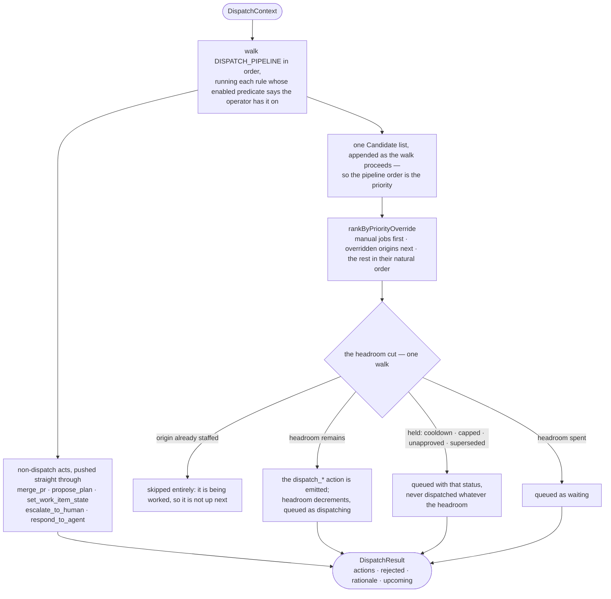

# 05 — Dispatch

The dispatcher answers one question per cycle: _given the world and the fleet, what should happen?_
Its output is a bounded, validated action plan — never direct effects.

```ts
interface Dispatcher {
  decide(ctx: DispatchContext): Promise<DispatchResult>;
}
```

`DispatchResult` is `{ actions, rejected, rationale, upcoming? }`.

## The action vocabulary

`src/dispatcher/actions.ts` defines the complete set as a zod discriminated union on `type`. This is
what makes an LLM decision-maker safe: it can only ever ask for one of these, and anything malformed
is rejected and audited rather than executed.

| Action                | Required payload                          | Optional payload                                                               |
| --------------------- | ----------------------------------------- | ------------------------------------------------------------------------------ |
| `dispatch_code_agent` | `branch`, `title`, `prompt`, `reason`     | `originRef`, `originTitle`, `originSummary`, `jobId`, `partId`, `base`, `rule` |
| `dispatch_desk_agent` | `title`, `prompt`, `reason`               | `originRef`, `originTitle`, `originSummary`, `jobId`, `rule`                   |
| `escalate_to_human`   | `escalationType`, `prompt`, `reason`      | `context`, `taskId`, `agentId`, `rule`                                         |
| `respond_to_agent`    | `agentId`, `response`, `reason`           | `originRefs`, `rule`                                                           |
| `reply_on_pr`         | `prNumber`, `draft`, `reason`             | `commentId`, `confidence` (0..1), `rule`                                       |
| `merge_pr`            | `prNumber`, `reason`                      | `method` (`merge`\|`squash`\|`rebase`, default `squash`), `confidence`, `rule` |
| `propose_plan`        | `planId`, `originRef`, `prompt`, `reason` | `rule`                                                                         |
| `set_work_item_state` | `number`, `state`, `reason`               | `rule`                                                                         |
| `no_op`               | `reason`                                  | `rule`                                                                         |

`reason` is mandatory on every action — it is what the audit log shows. `rule` defaults to `null`,
because an act reaching the executor from outside the pulse (an accepted proposal, agent lifecycle)
has no proposing rule. Every action also accepts an optional
**`admission`** beside it, defaulting to `null`: `rule` names what proposed the act, `admission` what
became of it, and both are lifted into their own decision columns (see
[Two columns on the decision row](#two-columns-on-the-decision-row)).

`parseActions(raw)` validates an array, partitioning into `actions` and `rejected` (each rejected item
keeps its raw value and a joined zod error path/message). Absent `confidence` is treated as **0**:
"no confidence stated" means never auto-send.

## The rule book

`src/dispatcher/rules.ts` holds the registry as data. Every action the `RuleDispatcher` emits carries
a `rule` id from it (and, when an admission transformed it, an `admission` id too);
`Store.recordDecision` lifts each into its own column, `decisions.rule` and `decisions.admission`; and
`/api/state` ships the whole registry so the cockpit's Decision log can expand a row into the rule
that fired and why that rule exists.

**A rule has no number.** It has a name and a position in `DISPATCH_PIPELINE`, and the position is
never rendered — the cockpit shows the id and the name. Numbers were hand-written on each entry and
rotted exactly as a second copy of an ordering always does: by the time they were removed,
`issue-assay` was numbered after `issue-plan` and evaluated before it, two entries both claimed `3b`,
and three claimed positions that were not positions (`1–2b`, `1–4`). Order lives in one array, and
`concernUrgency` reads that array rather than restating a slice of it.

`kind` splits the registry into two vocabularies:

- **`rule`** — proposes work from the world. These are the pipeline, in the order below.
- **`admission`** — decides what becomes of something a rule proposed (see
  [Admission](#admission)). Not ordered per-feature and not a stage.
- **`terminal`** — a property of the finished cycle rather than of any rule.

The registry keeps all three because `decisions.rule` is **persisted**: a row naming
`cooldown-escalate` must still resolve years later. So the registry is the display vocabulary and the
pipeline is the ordered subset that runs.

### The rules, in evaluation order

`enabled` is the predicate that switches an optional rule into the pipeline; a rule with none is
unconditional.

| Id                         | Name                                 | `enabled`        | Fires when                                                                                                                                                    |
| -------------------------- | ------------------------------------ | ---------------- | ------------------------------------------------------------------------------------------------------------------------------------------------------------- |
| `manual-job`               | Operator-launched job                | —                | A queued job exists. Drained ahead of every world-driven rule.                                                                                                |
| `pr-review-comment`        | Unhandled review comments            | —                | A PR carries unhandled review threads. All of them go to one agent.                                                                                           |
| `pr-ci-failing`            | Failing CI                           | —                | An open PR has failing CI that is not inherited from its base, at least one failing check is actionable under `ci.checks`, and no agent is on its branch.     |
| `pr-ci-blocked`            | CI blocked elsewhere                 | —                | Same, but every failing check is configured non-actionable and at least one asks to escalate. Asked once; no agent is dispatched.                             |
| `pr-ci-gate`               | Check waiting on an action           | —                | A `ci.checks` rule watches a check in a non-failing state (`states`) and the check is in it — a blocking gate sitting `pending`. Own origin `pr:<n>:ci-gate`. |
| `pr-base-update`           | Base out of date                     | —                | A PR is `behind` its base or conflicts with it.                                                                                                               |
| `pr-merge-ready`           | Merge-ready PR                       | —                | A non-stacked PR is green, approved, mergeable, and has no unhandled comments.                                                                                |
| `work-item-in-review`      | Back off to review state             | `workItemStates` | A work item in a pickup state has an open PR (or is decomposed).                                                                                              |
| `work-item-back-to-pickup` | Return from review state             | `workItemStates` | A still-open work item parked in the review state has no open PR and an explicit `more_work` conclusion.                                                      |
| `issue-assay`              | Issue goal needs checking            | `assay`          | A watched open issue nothing has been started for has no verdict on its goal text.                                                                            |
| `issue-plan`               | Issue needs a plan                   | `planning`       | A watched open issue has no plan yet — or an operator asked for a replan.                                                                                     |
| `issue-assess`             | Issue may be finished                | `assessment`     | A watched issue — open, **or a retained run** — has had work, has nothing in flight and no open PR.                                                           |
| `issue-shortfall`          | Assessment says the goal was missed  | —                | An assessment recorded that a watched open issue was worked and its goal is still not reached. Claims no headroom.                                            |
| `issue-retro`              | Delivered goal needs a retrospective | `retrospective`  | A goal the harness parked as delivered, with nothing in flight under it and no write-up yet, gets one desk agent to write the run up. Retained runs included. |
| `plan-approval`            | Plan needs your approval             | `planning`       | With `planning.requireApproval` on, a planner's verdict — either arm — is `awaiting_approval` and no verdict is pending.                                      |
| `plan-blocked`             | Approved plan is going nowhere       | `planning`       | Every live part of a released plan is blocked, so nothing will be dispatched for it. Asks a human once; dispatches nobody.                                    |
| `plan-part`                | Plan part ready                      | `planning`       | A part of an active plan is `ready` and unstaffed.                                                                                                            |
| `issue-pickup`             | Open issue without a PR              | —                | An eligible open issue has no **open** PR and no agent on it, and its plan says `single`. Never a retained run.                                               |

`workItemStates` is the one condition that is not a feature flag: it is true when the operator has
configured **both** `issueInReviewState` and a non-empty `issuePickupStates`.

The five PR-concern rules and `pr-merge-ready` run as **one pass** over the open PRs rather than six,
because at most one agent works a branch and the fold that picks the top concern has to see them
together. Their relative urgency is still their pipeline order — `concernUrgency` looks up the index.
The pass is registered in `STAGES` under `pr-ci-failing` and stays there whatever the order inside the
group: the six are contiguous, so nothing runs between them and the pass contributes at the same
point in the walk whichever id carries it. Moving the registration to track "the first of them" would
be a second copy of the ordering.

**A review outranks CI, CI outranks a waiting gate, and the gate outranks the base.** A review is the
one PR signal that can invalidate the diff rather than report something wrong around it — a reviewer
asking for a different approach means the code the CI failure is about, and the hunks the conflict is
in, are both about to be rewritten. An agent sent at CI or at a conflict first does work the next push
discards, and in the base case resolves the same conflict twice, since the rewrite re-conflicts the
branch. A failing check outranks a waiting one because it is a thing that broke rather than a thing
that has not happened yet, and a gate run against a red branch may have to be run again once it is
green. All of them still get their agent; they get it against the diff the review settled on.

#### `pr-ci-gate`: a check that waits rather than fails

An Azure `status` branch policy can be blocking, enabled, and `queued` indefinitely — the harness's
`checkStatusOf` maps it to `pending`, and nothing else in the system reads a pending check. The PR is
not red, so `ciNeedsAttention` is false and `pr-ci-failing` never fires; `prAttentionStatus` falls
through to "CI is still running" and stays there. The PR is stuck on a command a human has to run, and
before `states` there was no way to say so. Three choices carry this rule:

- **Its own origin, `pr:<n>:ci-gate`.** Sharing `pr:<n>:ci` with the real CI concern would put one
  cooldown budget across two unrelated problems: a red build spending its three attempts would leave
  the gate permanently capped without a single agent ever having been sent at it, and the
  `cooldown-escalate` raised at the cap would name whichever of the two the fold happened to pick. It
  would also break notify de-dup, which is keyed on the origin — a gate signal reaching an agent
  already on the branch is not the CI signal that origin already delivered. The cost is a PR that can
  carry two CI-ish concerns competing for one branch agent, and that cost is already paid: concerns
  fold per PR, the top one wins, the rest are re-raised next pulse. There is no equivalent machinery
  for un-conflating a shared attempt cap.
- **The re-dispatch loop ends at the attempt cap.** A watched-pending check may still be pending after
  the agent runs — clearing it is not the agent's to do, and the world has not changed, so the concern
  is raised again. Nothing about the gate self-clears, so the **only** thing that bounds it is the
  origin's own cap: three attempts, then `cooldown-escalate` hands it to a human on `pr:<n>:ci-gate`.
  That is why the origin split matters twice over — the escalation names the gate, and the gate's
  attempts are not spent by a build. Pinned by `test/ciPolicy.test.ts`.
- **Stacks: the same guard as CI, and no more.** The concern is suppressed when `inheritedCiFailure`
  attributes the PR's failure to a rung below it, so a PR whose real problem is the red base does not
  also collect an agent for its gate. It is _not_ suppressed merely for being stacked: a status policy
  is evaluated per pull request, so each rung of an otherwise-healthy stack genuinely has its own gate
  to clear, and suppressing those would park the whole stack on the bottom one.

The prompt is `pr-ci-gate`, written for a gate rather than a red build — `pr-ci-fix` tells an agent to
investigate a failure, which here is an instruction to go looking for a bug that does not exist. The
waiting check names and the rule's `guidance` are **appended** to the rendered template, never
interpolated: an operator override that predates this feature would silently drop a new `{token}`, and
the check names are the half the agent cannot act without.

### Where a rule's body lives

One module per rule under `src/dispatcher/rules/`, each exporting a single
`(s: StageContext) => void`. `RuleDispatcher.decide` keeps only the walk: it builds the context once,
looks each rule up in the `STAGES` map by id, and applies the cut. The bodies were closures inside
that one method, capturing some twenty of its locals without naming any of them, so what a rule read —
and, for the two sets below, what it _wrote_ for a later rule to read — was discoverable only by
reading every other rule.

`StageContext` (`rules/context.ts`) is that seam, and it carries the operator's policy objects
(`pickup`, `cooldown`, `templates`, `planning`, `ci`, `defaultBranch`, `workItemStates`) rather than a
handle on the dispatcher — a stage that could reach the class could reach anything on it, which would
relocate the coupling rather than remove it. Everything on it is derived once, before the first stage
runs: a projection of the world, an append-only collector (`raw`, `candidates`), or a predicate
several rules must answer identically (`partsPlanFor`, `deliveryParked`, `assayParked`, `consider`).
Deriving one of those twice is exactly how two rules come to disagree about an issue.

**`activeOrigins` counts work a requeue is redoing.** It is the origins of every active task, plus
the `originRef` of every job standing in for one (`DispatchContext.standingJobs`). A crash recovery's
requeue retires the task and files a job, whose own origin is `job:<id>` — so without the second half
the rule that produced the original sees nothing in flight and staffs the same work twice (#249). The
job's side of it is [13](13-jobs-and-findings.md#standing-in-for-another-origin).

**Two rules may act on a retained run; the rest say so themselves.** `ctx.world.issues` is the live
tracker unioned with the runs it has forgotten (#234 — see
[03](03-world-model.md#what-is-in-the-dispatchers-world-and-what-puts-it-there)), and
`StageContext.retained` names which are which. Only `issue-assess` and `issue-retro` act on one: they
are the two steps that come _after_ a merge, which is exactly when a PR carrying `closes #N` has
already taken the ticket out of the world. Every other rule excludes them **in its own body** —
`eligibleIssues` for `issue-plan`/`issue-pickup`, a direct `retained` test in the two work-item rules,
and `StageContext.liveIssue` for the plan- and shortfall-driven rules, which returns null for a
retained issue. None of them leans on the stub's `closed` state: it would refuse them by coincidence,
and coincidence is what a later change removes with nothing failing.

**Two fields are written by one stage and read by later ones, and that ordering is load-bearing.**
`assaying` and `assessing` are outputs of `issue-assay` and `issue-assess` and inputs to the stages
after them (`issue-plan` reads the first; `issue-pickup` reads both) — the whole mechanism behind
`superseded`. It works because `DISPATCH_PIPELINE` runs the writers first; moving either rule below
its readers would not fail to compile, it would silently stop suppressing and put two agents on one
issue.

Adding a rule is still two things and not three: a registry entry in the position it should run, and a
module registered in `STAGES` under that id. An id with no entry was covered by an earlier pass (the
PR pass above), and nothing anywhere renders a position.

### Not rules

| Id                  | Kind        | What it is                                                                                                                 |
| ------------------- | ----------- | -------------------------------------------------------------------------------------------------------------------------- |
| `branch-notify`     | `admission` | A fresh PR signal landed on a branch whose agent is already **running**, so it is delivered as a note, not a second agent. |
| `cooldown-escalate` | `admission` | An origin spent its dispatch attempts without clearing, so the proposal became an escalation.                              |
| `idle`              | `terminal`  | No rule emitted anything — recorded as a `no_op`, so idleness stays auditable.                                             |

## Admission

`src/dispatcher/admission.ts`. A rule answers _is there work here_; admission answers _may it
proceed, and if not, what does the operator get told instead_ — a different question, asked of every
proposal in the same way whichever rule made it.

These were four representations of one idea, none of which knew about the others: `branch-notify` and
`cooldown-escalate` were rule ids (so a throttled pickup audited as `cooldown-escalate` and lost that
it was `issue-pickup` that got throttled — closed by the `admission` column below);
`cooldown`/`capped`/`unapproved` were a `held` string on
the candidate; `waiting` was decided inline by the headroom cut; and **suppression was not
represented at all** — a rule superseded by an earlier one `continue`d, so its candidate vanished with
no queue entry and no reason anywhere. That is the same invisibility `capped` was introduced to fix.

| Verdict      | Becomes                                                                       |
| ------------ | ----------------------------------------------------------------------------- |
| dispatch     | The agent spawns.                                                             |
| note         | `respond_to_agent` on the branch's running agent (`branch-notify`).           |
| escalate     | `escalate_to_human` (`cooldown-escalate`).                                    |
| `cooldown`   | Queued, held by the per-origin re-dispatch throttle.                          |
| `capped`     | Queued, held by `maxConcurrentPartsPerIssue`.                                 |
| `unapproved` | Queued, held because the plan's decomposition is still a proposal.            |
| `superseded` | Queued, held because an earlier rule claimed this issue this cycle.           |
| `waiting`    | Queued, held by fleet headroom — the only reason the cut decides, not a rule. |

**Every held reason reaches the queue.** That is the contract, and it is what makes "nothing happened
and nobody can say why" unrepresentable.

### Two columns on the decision row

The vocabularies are split in the registry, and they are split on the audit row too: `decisions.rule`
names **what proposed** an act, `decisions.admission` **what became of it**. Both ride on the action —
`rule` and `admission` are optional fields on every action schema — and `Store.recordDecision` lifts
each into its own column. `AdmissionId` (`Extract<…, {kind: 'admission'}>` off the registry) types the
second, so a rule id structurally cannot land there.

| Emission                                | `rule`                    | `admission`         |
| --------------------------------------- | ------------------------- | ------------------- |
| An ordinary dispatch, merge, escalation | the rule that proposed it | null                |
| The PR-concern attempt cap              | the top concern's rule    | `cooldown-escalate` |
| `plan-part`'s attempt cap               | `plan-part`               | `cooldown-escalate` |
| `issue-pickup`'s attempt cap            | `issue-pickup`            | `cooldown-escalate` |
| The branch note                         | **null**                  | `branch-notify`     |

**Only these two admissions ever reach the column.** The rest (`cooldown`, `capped`, `unapproved`,
`superseded`, `waiting`) hold a candidate that was never executed, so there is no decision row for
them at all — they are queue statuses on the Up next projection and nothing more.

**The branch note's `rule` is null deliberately.** Its `fresh` set is a flatMap over every concern on
the PR, so one note can carry a CI signal and a review thread at once and no single rule proposed it.
Attributing it to the top concern would name a proposer picked by the _urgency_ order — which exists
to decide who gets the one agent when the branch is **free** — for a note whose other half that rule
never asked for. Nothing is lost by refusing: `originRefs` already lists every concern the note
covers, which is a finer answer than a rule id.

**Rows written before the split keep their shape, forever.** They carry the _outcome_ in `rule` with
`admission` NULL, and which rule was throttled on one is not recoverable — history is not rewritten.
Both cockpit renderers resolve a row through the shared `decisionAttribution`, which names such an id
as an **Outcome** rather than a proposer and states the gap, so the two shapes are told apart instead
of one being guessed into the other.

`askedAlready(origin, openEscalations, recentDecisions)` is the shared "has this already been put to a
human" predicate the three escalating rules (`pr-ci-blocked`, `plan-blocked`, `issue-shortfall`'s
escalate arm) use. Both readings are needed: an **open inbox item** is the visible state but outlives
the recent-decision window, and a **recent executed escalation** covers the case where the item has
been answered while the world has not moved.

## Rank-then-slice

Agent-dispatch rules do **not** dispatch inline. Each collects a `Candidate`
(`{origin, rule, title, kind, branch, reason, action, held?}`) onto one ordered list. Only after every
rule has run does a single walk apply the headroom cut:

- A candidate whose origin already has an active task is skipped entirely (it is staffed, so it is
  not "up next").
- A candidate with `held` set — `'cooldown'` or `'capped'` — is queued with that status and **never
  dispatched, whatever the headroom**.
- Otherwise, while headroom remains: the action is emitted, the origin is added to `activeOrigins`,
  headroom decrements, and the item is queued as `dispatching`.
- With headroom exhausted, the remainder queue as `waiting`.

The whole ranked list — above and below the cut — is returned as `DispatchResult.upcoming`
(`QueueItem[]`). This is what makes the cut visible instead of making below-cut work vanish.



**Any new dispatch rule must route through the candidate list.** An inline `raw.push` of a
`dispatch_*` action bypasses both the headroom cut and the queue.

### Candidate order

Candidates are appended as the pipeline is walked, so **the pipeline order _is_ the priority** — there
is no second list to keep in step with it. What each stage contributes:

1. **Queued jobs** (`manual-job`), oldest first — a manual request takes the next free slot.
2. **PR concerns** (`pr-review-comment` / `pr-ci-failing` / `pr-ci-gate` / `pr-base-update`), ranked **cross-PR** by
   concern class then by PR number. World order is arbitrary and must not decide who wins scarce
   headroom. Only the single most urgent concern per PR becomes a candidate, and "most urgent" is
   their pipeline order. An operator-flagged `urgent` CI check sorts its PR ahead of all of them, and
   is read off **every** concern on the PR rather than off the one that won — the flag is set by a CI
   check, which is not the top concern on a PR that also has an open review, and reading it from the
   winner would make the operator's escalation conditional on nobody having commented.
3. **Goal assays** (`issue-assay`) — asking whether a goal can be worked from comes before deciding
   _how_ to work it, so an assay ranks ahead of the planner and **supersedes both** the planner and
   the pickup for that issue this cycle.
4. **Planners** (`issue-plan`) — a planner unblocks work, so it wins a slot before the work it
   unblocks.
5. **Assessors** (`issue-assess`) — an assessment decides whether an issue needs work at all, so it
   is asked before the work is scheduled. An assessed issue is **superseded** from `issue-pickup`
   that cycle. `issue-shortfall`, which routes what an assessment found, claims no headroom and so
   appears nowhere in this ranking: it only proposes and escalates.
6. **Retrospectives** (`issue-retro`), a desk agent per delivered goal with no write-up.
7. **Plan parts** (`plan-part`), ranked by dependency depth, then issue number, then part sequence, so
   the bottom of a stack is cut before the branch its dependents will base on is needed. A part a
   **person** owns (`partIsHuman` — `expectedKind: 'human'`) is filtered out before any of that: it
   produces no candidate at all, so it costs no cooldown arithmetic, no attempt cap, no slot and
   nothing for the headroom cut to hold. It is deliberately not "queued and held" the way `capped`
   and `unapproved` are, because those two say _the fleet will get to this_ and this one never will —
   it is waiting on a person, and the cockpit's bench is where it is visible.
   → [13](13-jobs-and-findings.md#human-tasks)
8. **Issue pickups** (`issue-pickup`), ordered by label-encoded priority then issue number.
9. **Handed-over validation checks** (`validate-check`), last of everything. Validation's standing
   promise is that it blocks nothing, so a check must never take the final slot from a blocked part
   or a red build — that would make the one feature that gates nothing the reason something else did
   not run. Below the cut it queues as `waiting` like anything else, which is how a hand-over that
   the fleet has no room for stays visible instead of looking like a button that did nothing.

A superseded candidate is **queued, not dropped** — with the superseding rule named in its `reason`,
and attributed to the rule that proposed it rather than to whatever held it.

Non-dispatch actions (`merge_pr`, `propose_plan`, `set_work_item_state`, `escalate_to_human`,
`respond_to_agent`) are
pushed directly, because they claim no headroom.

### Operator re-ordering (issue #128)

The operator can change what the harness picks up first by re-ordering the cockpit's Up next panel.
Because the queue is a per-pulse projection, what persists is not the array but a **priority
override keyed on the candidate's origin** — the same stable identity every rule and gate already
uses. Overrides live in the `priority_overrides` store table and reach the dispatcher as
`DispatchContext.priorityOverrides`.

The pure `rankByPriorityOverride` (`src/dispatcher/priorityOverride.ts`) re-sorts the collected
candidates **once, immediately before the headroom cut**, into three tiers:

1. **`manual-job` items stay first**, in their own order — a manual job is distinct work, not a
   re-prioritisation of existing work, so an override never moves one.
2. **Overridden origins next**, by ascending rank (`0` = "do this next"). This is what jumps a
   world-driven item ahead of the natural cross-rule ranking above.
3. **Everything else** keeps its natural (already-ranked) order, so an item the harness surfaces
   later slots in behind the arranged prefix until the operator re-arranges.

It **only re-orders**. It never clears a `held` verdict: a cooldown, cap, pause, ignore tag or
unapproved plan holds an item wherever the override places it, because the cut walk reads `held`
independently of position. Overriding a hold _into_ dispatch is a different feature, out of scope.

An override is written by `POST /api/upnext/order` (replace-all) and pruned once its origin stops
being tracked — see [16](16-http-api.md) and [14](14-persistence.md).

## `QueueItem`

```ts
{ origin, rule, title, kind, branch, status: 'dispatching' | HeldReason, reason }
```

`status` is `dispatching` or one of the held reasons in [Admission](#admission) — `waiting`,
`cooldown`, `capped`, `unapproved`, `superseded`. `rule` is always the rule that **proposed** the
candidate; what held it is the status.

`Harness` caches the last plan as `harness.upcoming` (`{cycleId, at, items}`), and
`buildStateSnapshot` ships it as `upcoming`. It is a **per-pulse projection recomputed from the world
every cycle**, not a persisted FIFO.

## The re-dispatch cooldown

`src/dispatcher/dispatchCooldown.ts`. The dispatcher's origin de-dup only sees _currently active_
tasks, so an agent that finishes without clearing its concern would leave the origin dispatchable and
be re-spawned every heartbeat. `dispatchVerdict(origin, now, recentDecisions, policy)` supplies the
missing memory, purely from the audit log:

| Verdict    | Meaning                                                           |
| ---------- | ----------------------------------------------------------------- |
| `dispatch` | Free to (re-)dispatch.                                            |
| `cooldown` | Attempted too recently; queued as held, retried after the gap.    |
| `escalate` | The attempt cap is spent and no human has been looped in yet.     |
| `hold`     | Cap spent and already escalated — do nothing, do not re-escalate. |

`DEFAULT_COOLDOWN` is `{ maxAttempts: 3, cooldownMs: 900000 }` (15 minutes). Only **executed**
dispatches count as attempts: a deferred one (paused, or no headroom) never ran. "Now" is the world
snapshot's `takenAt`. An `escalate` verdict emits `escalate_to_human` carrying the throttled rule as
its `rule` and `cooldown-escalate` as its `admission`, and claims no headroom.

## One agent per branch

For a PR whose branch already has an active task, `resolveBranchAgent` returns:

- **`running`** — the branch's agent is live. Every fresh, not-yet-notified concern is collapsed into a
  single `respond_to_agent` note listing them, carrying the concern origins in `originRefs`. It is
  recorded with `admission: 'branch-notify'` and **no** `rule`: it folds several concerns, so no one
  rule proposed it (see "Two columns on the decision row").
- **`busy`** (queued / starting / **waiting**) — every note is held. Injecting into a waiting agent
  would call `agents.respond`, which flips `waiting → running` and would derail a pending human
  escalation. The signals persist, so a later cycle delivers them once the agent is running.
- **`free`** — a dispatch candidate.

Notify de-duplication reads `recentDecisions`: `notifiedOriginsByAgent` collects `agentId::origin`
pairs from **executed** `respond_to_agent` decisions, so a persistent signal is not re-notified every
cycle. It is best-effort over the recent window — a note that ages out simply gets sent again.

## `work-item-in-review` / `work-item-back-to-pickup` — work-item state

Opt-in: it fires only when the operator set **both** `issueInReviewState` and a non-empty
`issuePickupStates`, and only for items carrying a native `workItemState` (Azure work items; GitHub
issues have none, so it is a no-op for them). It never fires on a closed item.

- Item in a pickup state **and** (an open PR exists for it, or its plan is decomposed) → move it to
  `issueInReviewState`. Decomposed is `partsPlanFor`, which asks the plan's **parts**, not its status
  ([08](08-planning.md#shape-is-the-parts)): a plan being delivered as one pull request is `active`
  too, and reading that as decomposed would park its work item in the review state for the life of a
  plan that schedules nothing.
- Item in `issueInReviewState` with no open PR **and an explicit `more_work` conclusion** → move it
  back to the **first** entry of `issuePickupStates`. There is no separate config for the return
  state: the first pickup state is the operator's own "start here".

Both directions are idempotent — after either move the item no longer matches.

The inverse arm's gate is the conclusion, **not** the absence of a PR, and that is load-bearing.
`openPrForIssue` reads only the open list, so "this PR merged" and "there was never a PR" are one
observation; releasing on absence therefore bounced a merged ticket back to "Ready" and had rule `issue-pickup`
put a fresh agent on work already sitting on the default branch. `done` and `undeclared` both leave
the item where it is — see [the conclusion verdict](06-issue-pickup.md#concluding-an-issue) for why
silence stops the harness rather than releasing it.

A decomposed item needs no special case here: an in-flight plan resolves to `more_work` through the
roll-up and a `complete` one to `done`, which is exactly what the old explicit `decomposed` check
gave it — the item stays in the review state for the whole life of its plan rather than bouncing back
to "Ready" in every gap between parts.

## `issue-assay` — the goal assay

`assay.enabled` (**on by default**) puts an assaying agent in front of the whole funnel. Every other
gate an issue passes asks whether the harness is _allowed_ to act; this is the only one that asks
whether the ticket says anything to act on. Full argument, the verdict's lifetime and what ends a
hold are in [06](06-issue-pickup.md); the dispatcher's half is:

- A **code** agent — the judgement needs the repository — on branch `assay/issue/<n>`, origin
  `issue:<n>:assay`, based on `defaultBranch`. Its own branch namespace for `plan/issue/<n>`'s hard
  reason: git cannot put `refs/heads/issue/12/assay` beside `refs/heads/issue/12`.
- Driven off `eligibleIssues` (unlike rules `issue-assess` and `plan-part`), because an issue the state gate or the watch
  gate excludes is not going to be worked and so has nothing to assay.
- Fires only when nothing has been started: no verdict against the issue's _current_ text, no prior
  work (`hasWorkStarted`, now exactly `hasPriorWork` — it began as that predicate with the assay's
  own tasks filtered out, or a crashed assayer would retire its own retry, and `issueOriginRole` now
  makes that exclusion for every deliberation origin), no plan row, and nothing live on `issue:N` or
  any `issue:N:*`.
- **Suppresses rule `issue-plan` and rule `issue-pickup` for that issue this cycle**, from a set built once, so the three
  rules cannot hold different opinions about which issues are in it.
- **Fails open**: a spent attempt cap returns the issue to the funnel with no escalation, exactly as
  the planner and the assessor do, because narrowing pickup without that would make the assay the
  most effective way to stop the harness working.

`dispatchReason` and the prompt carry the issue's title and body, and the dispatch's `originTitle` /
`originSummary` are what the verdict is later fingerprinted against — dropping them would stamp every
verdict with the fingerprint of an empty goal.

## `issue-assess` — the assessor

`assessment.enabled` (**on by default**) puts an assessing agent in front of re-pickup. It exists
because rule `work-item-in-review`'s park is a **tracker state**, so it only protects providers that have one: on
GitHub there is no review state, `openPrForIssue` reads only the open list, and the moment a
delivering PR merges the issue is again "open, watched, no open PR" — rule `issue-pickup`'s entire precondition.
A fresh agent is then put on work already sitting on the default branch, bounded only by the attempt
cap. `delivered` is the same park, generalised off the tracker onto a row the harness owns.

The window it fires in used to be the gap between a merge and the ticket closing, and a PR carrying
`closes #N` makes that gap **zero**: the assessor never ran, no `issue_deliveries` row was written,
and `issue-retro` — whose only precondition is that row — never fired either, so the goal's Satellite
and Manifest stayed unbuilt permanently. Since #234 the run outlives the ticket and the question stays
askable until the operator dismisses it.

The rule dispatches a **code** agent — it needs a worktree to read what was delivered — on branch
`assess/issue/<n>`, origin `issue:<n>:assess`, based on `defaultBranch` (merged work is _on_ it, so
it is the only checkout in which the question can be answered). The branch namespace is not
cosmetic, for `plan/issue/<n>`'s reason: git stores refs as files, so `refs/heads/issue/12` and
`refs/heads/issue/12/assess` cannot coexist.

It fires for issue N when all of:

- N is open **or a retained run** (#234), and passes `issueWatchGateReason`. Deliberately **not**
  driven off `eligibleIssues`, for rule `plan-part`'s reason — that list applies the workflow-state
  gate, and the Azure case this must cover is precisely an item rule `work-item-in-review` parked in
  the review state.
- No `delivered` verdict stands, no open PR, and no plan still scheduling something — `planInFlight`
  (`src/plans/parts.ts`), which is `planning`/`awaiting_approval`, or `active` **with live parts**.
  The shape matters here: an `active` plan with none is the single-PR arm, and its one PR having been
  worked is the case this rule exists for ([08](08-planning.md#shape-is-the-parts)).
- Nothing live on `issue:N` or any `issue:N:*` origin.
- **At least one task has ever existed** on an origin that could have _delivered_ something
  (`hasPriorWork`).
- `dispatchVerdict('issue:N:assess')` says dispatch.

The prior-work condition does two jobs. It stops the assessor being noise — without it a brand-new
issue satisfies every other precondition trivially, since nothing is in flight because nothing ever
started. It is also the **discriminator that lets assess and pickup coexist** on an issue both would
otherwise claim: no prior tasks means the work has not started, so rule `issue-pickup` picks it up; prior tasks
with nothing in flight means it may be finished, so the assessor asks. An issue the assessor claims
this cycle is **suppressed** from rule `issue-pickup`, or two agents land on it — one judging, one redoing.

**Which origins count is decided in one place**, `issueOriginRole` (`src/issueOrigins.ts`), because
the `issue:N:*` subtree holds two materially different things. The pickup root and a plan's parts are
the **work**; `issue:N:assess` is not work but only ever happens downstream of some, so it counts as
**evidence**; `issue:N:plan` and `issue:N:assay` are the harness **deliberating**, and a task on one
of those says the issue has been thought about, never that anything was built. Matching the whole
subtree was a real defect: the planner's own task made every issue routed to `single` look worked, so
it was assessed instead of picked up, the assessor honestly reported nothing delivered, rule `issue-shortfall`
replanned, and the issue cycled the funnel without a line of its work ever being written. An
**unrecognised** suffix is its own answer rather than a silent default — that is exactly how `:plan`
slipped through — and `hasPriorWork` does not count it, failing toward a redundant pickup an operator
can see rather than a parked issue they cannot. `test/issueAssess.test.ts` asserts the whole known
vocabulary, so the next origin added has to be classified rather than inherited.

It is answered from `ctx.tasks`, **never from the work graph**. The graph is keyed on these same
origin strings, which is why it reads like a graph query; it is the same question asked of the source
the dispatcher already holds. Nothing in `src/dispatcher/` reads the graph — see
[`14-persistence.md`](14-persistence.md).

**It fails open**, exactly as the planner does: a spent attempt cap returns the issue to ordinary
pickup with **no escalation**, because narrowing rule `issue-pickup` without that turns any assessor crash into a
permanently parked issue. A cooling assessor suppresses pickup for that cycle only and stays visible
in the queue as `cooldown`.

The agent casts its verdict with the `assess_issue` tool ([`11-mcp-tools.md`](11-mcp-tools.md)):
`delivered` writes the park, `more_work` writes an `issue_shortfalls` row that rule `issue-shortfall` routes. See
[`06-issue-pickup.md`](06-issue-pickup.md) for what the park holds and what ends it.

## `issue-shortfall` — routing a failed assessment

The other end of the loop the assessor opens. Plan → Work → is the goal achieved? → No → re-plan:
the check was rule `issue-assess`, the replan was `POST /api/plans/:id/replan`, and **nothing joined them**. A
negative verdict was written into `issue_conclusions`, whose only consumer is rule `work-item-back-to-pickup`
— which emits a _tracker_ move, so it fires only where `issueInReviewState` is configured. On GitHub
it changed no dispatch at all; and on either provider, for an issue with a plan, rule `issue-pickup` is gated on
the `single` route and rule `plan-part` finds every part settled. The assessor said "not delivered" and the
harness scheduled nothing, anywhere.

This rule is the one consumer of `issue_shortfalls`, and it routes by the cause the assessor
**declared** rather than one the harness derived. Deriving it would send every shortfall to a replan
and re-decompose plans whose shape was never the problem — the failure the issue itself names.

| cause  | means                                                        | arm                                         |
| ------ | ------------------------------------------------------------ | ------------------------------------------- |
| `plan` | the decomposition is wrong — a part is missing, or the split | **A** — propose a replan                    |
| `part` | the split was right; one named part missed its own scope     | **B** — propose one appended follow-up part |
| `goal` | the issue itself is wrong, ambiguous or obsolete             | **C** — escalate, and schedule nothing      |
| _none_ | nothing was named beyond "the work is not finished"          | nothing at all                              |

**Arm A** flips the plan to `planning`, which is the entire effect: rule `issue-plan` already routes such a
plan back to a planner with the `issue-replan` prompt and `currentPlanSummary`, and `plannerVerdict`
already narrows the cooldown to decisions since `plan.updatedAt` so the original planner does not
throttle it. `releasePlan`'s pattern — one status write, and a rule that was already there starts
working. The assessor's summary is appended to `plan.reason`, which `currentPlanSummary` already
renders, rather than to a new `{shortfall}` placeholder an operator override could silently drop.

**Arm B** appends one part (slug `<slug>-followup`, `dependsOn: []`, the assessor's summary as its
scope) through the same `upsertPlanParts` an amendment uses, and leaves the part that fell short
**exactly as it is**. Returning it to `ready` is the tempting version and the wrong one:
`partHasWork` is the existing statement of why — a merged part's PR is on the default branch and its
branch is spent, so re-dispatching puts an agent on a branch whose PR is closed. Appending meets
"never retire a part with work started" by construction rather than by a check. The plan moves
`complete` → `active` through the roll-up it already computes.

**Arm C** files an escalation and schedules nothing. It is deliberately **not** a proposal: a
proposal whose accept and reject both do nothing is not a decision. It is deduped the way rule `pr-ci-blocked`'s
escalation is — on an open item for `issue:<n>:shortfall` **and** on a recent executed one in the
audit log, each covering the other's blind spot.

Arms A and B are `Proposal`s (kind `shortfall`, ref `issue:<n>:shortfall`) because both spend a
fleet, and a plan the harness rewrote on its own would churn `plan_parts` under whatever is running.
The **full** `proposalHold` applies, unlike a plan proposal's: the row persists until its arm is
performed, so without the durable `rejected` arm one refusal would be re-asked every pulse. It
expires on world signal like any other rejection — `proposalWorldRef` maps the ref to `issue:<n>`
unmodified — or a replan refused once would veto every future one.

**The loop is bounded by machinery that already exists.** The human is the outer bound: nothing is
rewritten without a click. `dispatchVerdict`'s cooldown and 3-attempt cap on `issue:<n>:assess` is
the inner one, so `assess → propose → replan → work → assess` is bounded at three rounds by a
counter already in the code. Nothing new counts it: a second counter claiming to bound the same loop
would be two answers to one question.

**With the funnel off, both plan-shaped arms degrade to arm C** rather than being taken. A replan
needs rule `issue-plan` to pick the `planning` plan up and a follow-up needs rule `plan-part` to schedule it, so
accepting either with planning disabled would park the issue on a transition nothing consumes — the
same fail-safe direction as the planner's and the assessor's.

Rejecting acts on nothing and **leaves the row standing**: the verdict is still true, you declined to
act on it, and the cockpit chip should keep saying so. That is the asymmetry with `refusePlan`, which
exists only because a plan is the sole thing that schedules anything for a decomposed issue. A
shortfall gates nothing, so refusing one leaves the issue exactly where it was.

## `issue-retro` — the retrospective

`retrospective.enabled` (**on by default**) puts one **desk** agent on a goal the harness has already
parked as delivered, to write the run up: what shipped, and what came out of the process of shipping
it. It is the consumer of a step the cockpit had always named and the harness had never taken — _report
what was done_, which drew the working agent's conclusion note or an em dash and was read by nothing.
The goal page's tail draws it now ([17](17-cockpit.md#the-pull-requests-and-the-tail)).

It fires when the issue passes the watch gate, has a standing delivery (or resolves `done`), has no
`retrospectives` row, and has nothing live anywhere under `issue:<n>`. **A retained run counts**
(#234) and is deliberately not gated out: this and `issue-assess` are the two rules the union of
forgotten runs into the issue list exists for, since both come after the work is over — which is
exactly when a delivering PR has already closed the ticket. The origin is
`issue:<n>:retro`, its own for `assessOrigin`'s reason: the cooldown and attempt cap that throttle
write-ups must not eat the budget that gets work done. There is no branch and no worktree — the agent
writes no files, and a checkout would only tempt it to start work on a finished goal.

**It gates nothing, and that is what makes the fail-open cheap.** A goal is delivered whether or not
anybody wrote it up, so an agent that crashes, is killed or spends its attempt cap leaves no row, no
escalation and no hold: the station reads _Nothing written_. No escalation is raised because there is
nothing a human can do about a report that did not happen that they cannot do by reading the issue.

### What the agent is handed

Two things, both **appended** to the rendered `issue-retro` prompt rather than interpolated into it —
`loadPromptTemplates` rejects only _unknown_ placeholders, so a `{dossier}` token would be silently
dropped by exactly the overrides that customised most:

1. **The scratchpad** for its issue, attributed and quoted (`padTestimony`). This is the half nothing
   else could supply: what the agents that did the work chose to record for whoever came next.
2. **The dossier** (`retroDossier`, `src/retro/dossier.ts`), the record only the harness kept — the
   plan and its parts with their outcomes, the pull requests open and closed, the decisions with the
   rule ids that fired, escalations and how they were answered, proposals, the assay, the delivery,
   any shortfall, the conclusion, findings, agents spawned and reported spend. It **reads rows the
   pulse already wrote and derives no verdicts**: a fold that computed one would be a second opinion
   about a decision made somewhere else.

Assembled in `ActionExecutor.recordDispatchTask` for the branch gate's reason — every dispatch passes
through it — and keyed on the exact retro origin, so a finished goal's audit trail never lands in
front of an agent dispatched to fix CI.

Every row it gathers is selected by one predicate, `mine`: the ref **equals** `issue:<n>` or starts
with `issue:<n>:`. The boundary is the point. A bare `startsWith('issue:1')` also matches
`issue:19:plan:plan`, so on any repository with more than nine goals the dossier quietly attributes
another goal's record to this one — the failure is invisible because the dossier is prose and reads
perfectly well either way.

The agent submits with `retro_submit`; the summary is required, the document is trimmed rather than
refused, and the write upserts on the issue so a revision is one row. Nothing is posted to the
tracker and nothing is scheduled from what it says.

## `validate-check` — running a handed-over check

`validation.enabled` (**on by default**) puts a code agent on one validation check the operator
handed to the fleet. Everything about what a check _is_ is [20](20-validation.md); the dispatcher's
half is:

- A **code** agent — a check runs things — on branch `validate/issue/<n>/<checkId>`, origin
  `issue:<n>:validate:<checkId>`, based on `defaultBranch`. Its own branch namespace for
  `assess/issue/<n>`'s hard reason, and the check id on both so two handed-over checks get two
  worktrees rather than fighting over one.
- **One origin per check, never one per goal.** The origin carries the cooldown and the attempt cap,
  so a shared one would let a check that can never be run spend the attempts of the four beside it —
  `pr-ci-gate`'s split against `pr-ci`, argument for argument.
- Fires only for a goal **parked as delivered**, a **retained run included** (`issue-retro`'s
  reason — it runs after the work is over, which is when a delivering PR has closed the ticket). A
  check is executed against the delivered goal; run mid-flight it reports a failure about something
  that does not exist yet.
- **The hand-over is the whole gate.** `fleetCandidate` is the planner's nomination and dispatches
  nothing: whether an agent _can_ run a check depends on what logins and browsers this deployment
  has, which a planner reading the repository cannot know. `actor` is written by one route and one
  operator.
- **Fails open and silent**, `issue-retro`'s rule: a crashed or capped agent leaves the check `unrun`
  and still flagged, with no escalation. The flag is already the ask.

The check's own procedure, expectation and resource names are **appended** to the rendered
`validation-check` prompt rather than interpolated — the half the agent cannot act without, and an
override that predates the rule would silently drop a new `{token}`.

The agent answers with `validation_report` ([11](11-mcp-tools.md)), whose third arm — `handback` —
returns the check to the operator without recording a reading. See
[20](20-validation.md#the-hand-over) for why there are three answers rather than two.

## `pr-merge-ready` — the merge gate

A PR is merge-ready when **all** of:

- it is not stacked (`isStackedPr(pr, defaultBranch)` is false),
- `ciStatus === 'passing'`,
- `approved === true`,
- `mergeable === true`,
- `mergeableState` is none of `behind`, `blocked`, `dirty`,
- every entry of `unresolvedComments` is `handled`.

It emits `merge_pr` with `method: 'squash'` and `confidence: 0.9`. The executor then authorizes it —
merging or putting it to a human — see [09](09-execution.md#authorizing-an-outbound-act).

**Unless a verdict on `pr:<n>:merge` is standing.** `proposalHold(kind, ref, ctx.proposals,
{rejectionSignals: ctx.rejectionSignals})` suppresses the rule while the merge is unanswered or has
been rejected, so one question is asked once. A rejection stops standing at the first world event on
that PR since it was given (`DispatchContext.rejectionSignals`, wired in `harness.ts`), at which point
this rule fires again — and the merge-readiness list above still has to pass, which is what keeps the
expiry from re-asking on a PR that has merely been commented on.

## The rationale

`buildRationale` produces `"Rule dispatcher: nothing actionable."` for a lone `no_op`, otherwise
`"Rule dispatcher chose N action(s): <types>"`. It is persisted as its own decision row each cycle.

## Prompt templates

`src/dispatcher/promptTemplates.ts` holds every agent- and escalation-facing prompt the rule
dispatcher emits, each under a stable `PromptId`, each with a built-in default, a declared placeholder
list, and a doc string.

Ids: `issue-plan`, `issue-replan`, `discuss-plan`, `plan-part`, `plan-approval`, `issue-shortfall`,
`plan-part-escalation`, `issue-pickup`, `issue-pickup-escalation`, `issue-assess`, `issue-assay`,
`issue-retro`, `validation-check`, `pr-ci-fix`, `pr-base-update-behind`, `pr-base-update-conflict`, `pr-review-comment`,
`pr-concern-escalation`, `finding-ticket`, `work-item-ticket`. The last two are route-driven rather than
dispatcher-driven — they are here because _how a ticket should be worded_ is the operator's opinion,
which is what the book exists to make overridable.

Overrides: drop `<id>.md` into `promptTemplatesDir` (default `.lubbdubb/prompts`). They are read
**once at boot**. `loadPromptTemplates` fails fast — at boot, not as a silently broken prompt — when a
file names no known id, references a placeholder the id does not declare, or is empty once its doc
header is stripped. A single leading `<!-- ... -->` block is stripped before the prompt reaches the
agent; a comment inside the body is left alone. `renderTemplate` substitutes `{name}` tokens and
leaves an unmatched token untouched.

`docs/prompt-templates/` holds ready-to-copy samples of the current defaults, one file per id.

### What an escalation prompt may be

**An escalation's `prompt` opens with a one-line lede, and never carries text the harness is quoting
from an agent.** The cockpit reads the first paragraph as the card's headline and everything after it
as the body ([17](17-cockpit.md)), so a prompt that opens with a paragraph opens with a wall.

Quoted text goes beside the prompt instead, as `context.detail`, with `context.detailFrom` naming who
wrote it. That is what rule `issue-shortfall` does with an assessment, rule `plan-approval` does with
the plan's diagnosis and approach, and rule `pr-ci-blocked` does with its list of escalate-only checks
— all of them used to splice them into the sentence, and an assessment is up to two thousand
characters. Templated, an operator override could bury it mid-paragraph again;
carried beside the prompt, no override can reach it. The three templates that are an escalation's
_whole_ prompt — `issue-pickup-escalation`, `plan-part-escalation`, `pr-concern-escalation` — render
to a single line, asserted in `test/promptTemplates.test.ts`.

`plan-approval` and `issue-shortfall` are deliberately multi-paragraph: what accepting and rejecting
_do_ is the harness's own prose, it is not quoted from anyone, and the card renders it as the body
under the headline. That is the split working, not an exception to it.

**The refusal is not on the action schema, and that is deliberate.** `parseActions` _drops_ a rejected
action into the audit log, so a length or newline check on `escalate_to_human.prompt` would make a
rule that wrote a blob stop escalating altogether — trading an ugly card for a question that never
reaches a person. The prompt builders are pure functions with unit tests instead
(`shortfallEscalationPrompt` in `src/delivery/shortfall.ts`).

`PromptTemplates.describe()` returns the whole book — id, doc, placeholders, the **effective** text
and whether an override replaced it — which is what `GET /api/prompts` serves to the cockpit's
Prompts panel ([16](16-http-api.md#get-apiprompts), [17](17-cockpit.md)). `overridden` is held on the
book from the overrides it was constructed with rather than re-derived by comparing text back against
the registry: the book is the one thing that knows an override happened, and a consumer deciding it a
second way could disagree with it.
