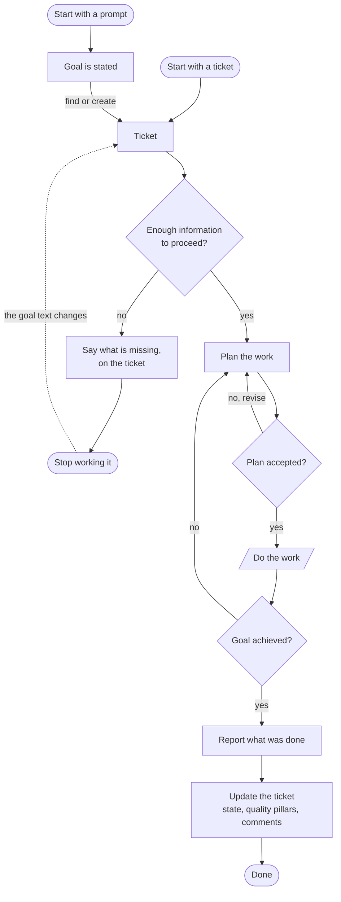
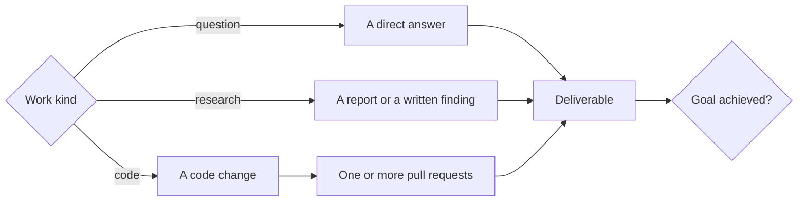
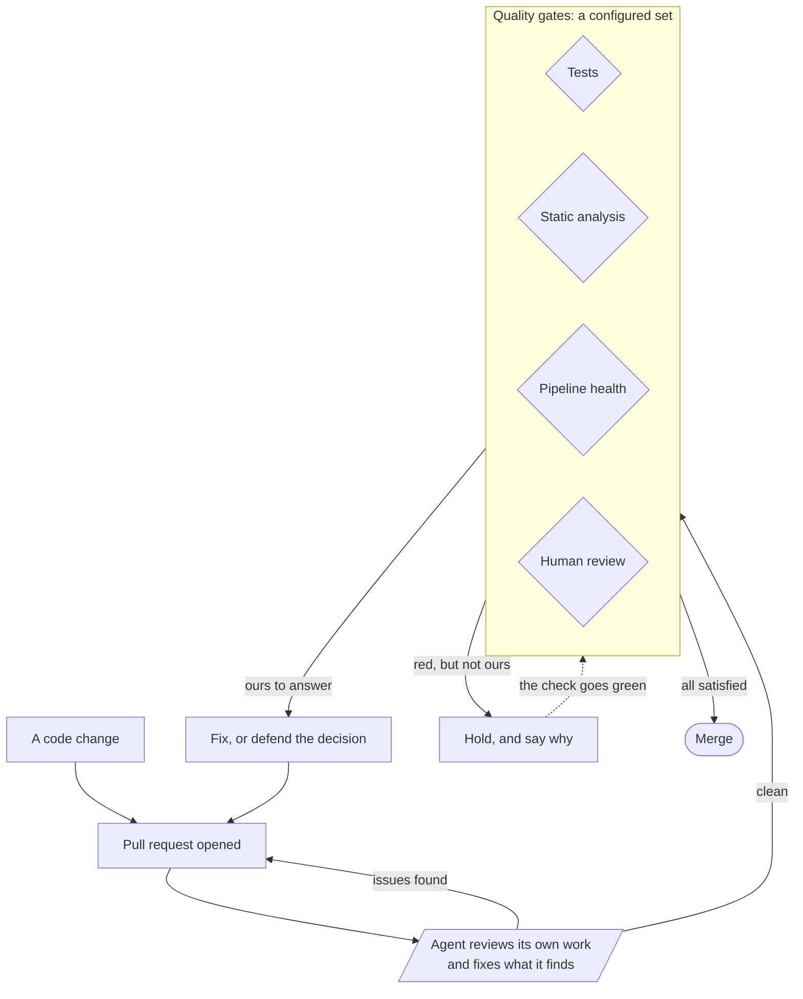
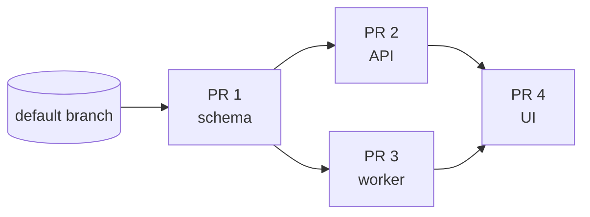

# The target workflow

This document describes the **workflow LubbDubb is being built to run end to end**. Unlike
[`spec/`](README.md), it is not a statement of current behaviour: most stages below exist and are
described in the spec, and a few exist in a narrower form than they are drawn. The last section says
which is which, so this document can be checked rather than believed.

Its second purpose is to say **which stages are generic**. The workflow drawn here is one shape the
harness runs; the stages are deliberately points of variation, so a team whose quality bar, tracker
or deliverable differs slots into the same loop rather than needing a different one. The CI stage is
the worked example — it is already a configurable rule set rather than a fixed "run the tests" step.

## The whole loop

Two entry points, one path. A prompt states a goal and a ticket is found or created for it; a ticket
states its own. Everything downstream keys on the ticket, so work started from a prompt is as
recoverable, reviewable and reportable as work started from the tracker.

Three gates carry the loop, and each is a decision someone or something has to _make_ rather than a
step that always passes:

- **Enough information to proceed** rejects a goal nothing can act on, before an agent spends
  itself discovering that. Refusal is not silent — it says what is missing, on the ticket — and it
  is not permanent: the hold ends when the goal text changes.
- **Plan accepted** is where a human sees the shape of the work before it happens.
- **Goal achieved** is asked of the delivered work, not of the agent's confidence, and its `no` arm
  returns to planning rather than to coding — what is missing may be a different decomposition.

## The work is not always code

`Do the work` is a fan-out. Code is the most complex arm and the one the rest of this document
zooms into, but it is one arm of several, and the loop above closes the same way whichever runs.

The set of arms is the point of variation, not the number three. What the loop requires of an arm is
only that it produce a deliverable and a declaration that it finished — not that the deliverable is
a diff. A piece of work whose honest outcome is _"nothing to build, here is why"_ completes; it does
not sit forever waiting for a pull request that is never coming.

## The code arm

The self-review step is drawn on **every** pull request, before any gate is consulted, because it is
the cheapest place to catch the things a reviewer would otherwise spend their attention on. It is the
one stage in this document the harness has no mechanism for — see [below](#where-this-stands-today).

**The gates are a set, not a list.** Tests, static analysis, pipeline health and human review are
four instances of one shape: something reports a verdict on the pull request, and each verdict is
classified into what to do about it. The classification is the configurable part, and it is per
check rather than per pull request:

| The check is             | The response                                                             |
| ------------------------ | ------------------------------------------------------------------------ |
| ours, and failing        | fix it, with guidance specific to that check where the guidance is known |
| ours, and flaky          | fix it, with more latitude                                               |
| red, but not ours to fix | do not send an agent at it — hold, say why, and wait for it to clear     |
| unrecognised             | fix it, and name it, so a check added later is never silently ignored    |

That last row is what keeps a configured gate set honest: a new check nobody has written a rule for
is treated as actionable and _named_, rather than parked forever as an unknown.

**The third row is the one that changes what the workflow can express**, and the clearest case for
it is a check on the health of the deployment pipeline itself. It fails when the pipeline is in no
state to receive changes. It is a real signal, it is correctly blocking — stacking more changes into
a broken pipeline is exactly what it exists to prevent — and there is no fix an agent could write,
because nothing about this pull request caused it. Without per-check classification the only
readings available are _red, therefore fix it_ and _ignore this check entirely_, and both are wrong:
one sends an agent at a wall, the other merges into the broken pipeline the check was warning about.
The right reading is a third one — **wait** — and it needs a per-check rule to say so.

Getting it wrong is expensive in a way that is easy to miss. An agent sent at a wall it was never
getting through burns its attempts and then escalates in a way that reads as its own failure. So the
gate holds instead, and the reason reaches both the human and the agent — an agent that cannot see
the held check watches CI stay red after a correct fix and starts chasing a failure that was never
its own.

The hold ends when the check does. Nothing re-asks a human and nothing times out, because the thing
being waited on reports its own recovery.

`Fix, or defend the decision` is deliberately two verbs. A review comment is not automatically
correct, and a workflow whose only response to a comment is compliance produces work that drifts
toward whoever comments most.

## A stack of pull requests

A single goal is often one pull request. When it isn't, the parts are not independent — they have a
dependency chain, and each is based on the one it depends on rather than on the default branch.

Arrows read _is the base of_. Three consequences shape the code arm above:

- **A part may depend on at most one other part.** With two, both could be in review at once and
  there would be no single branch to base on.
- **A stacked pull request's checks run the commits underneath it**, so one red base turns the whole
  stack red. The failure is attributed to the pull request that actually owns it, and the others are
  held rather than staffed — otherwise one broken base puts an agent on every pull request above it,
  each fixing code that is not theirs.
- **Merging happens bottom-up.** A green part 2 must not merge into part 1's branch while part 1 is
  still in review.

A part can also finish without a pull request at all — see the fan-out above. A part whose answer is
_"nothing to build here"_ reaches a terminal state, so the stack completes and the goal check is
reached rather than the whole plan parking on one part that was never going to produce a diff.

## Where a different workflow slots in

Every stage below is a point of variation. The middle column is the question a team answers
differently; the right column is how that answer is expressed.

| Stage                    | What varies                                                         | Expressed as                                                                                   |
| ------------------------ | ------------------------------------------------------------------- | ---------------------------------------------------------------------------------------------- |
| Intake                   | which tickets are in scope at all                                   | the watch tag, tracker workflow states                                                         |
| Enough information       | how strict the bar is, and who sets it                              | on/off, plus an operator verdict that overrides it                                             |
| Plan                     | whether work is decomposed before it starts                         | on/off                                                                                         |
| Plan accepted            | whether a human sees it first                                       | a proposal a human settles — in LubbDubb, always, with no switch                               |
| Work kind                | what a deliverable may be                                           | the terminal an agent declares when it finishes                                                |
| Quality gates            | which checks exist and what each failure means                      | a per-check rule set, as in the table above                                                    |
| Human review             | whether a reply goes out unattended                                 | a confidence threshold plus an allow-list, else a human accepts                                |
| Readiness to merge into  | what must be true of the target before landing                      | a check on the pull request, held by its rule until it clears                                  |
| Merge                    | when a pull request is allowed to land                              | health predicates plus the stack rules                                                         |
| Report and ticket update | what a finished piece of work must leave behind                     | prompts, which are operator-overridable files                                                  |
| After the merge          | where work travels once it lands, and what arriving somewhere means | a list of environments, each naming the commit it is at, and optionally what its arrival opens |

The pattern across the rows is the same one: **the harness owns the loop, the operator owns the
verdicts.** Where a stage needs judgement — is this goal clear, is this plan right, is this failure
ours, may this go out — the judgement is configuration or a human decision, not a branch in the
code. Where a stage needs wording — how a ticket is written, how a report reads — it is a prompt
template, so house style is changed by dropping in a file.

Two stages are deliberately _not_ variable, because making them so would remove the property they
exist for:

- **Every act that reaches the outside world is authorized by you** — either on the act itself, or
  by a standing landing you clicked over a named stack. The harness authorizes nothing on its own,
  and there is no arm where an agent posts, merges or files unasked.
- **An agent declares that it finished; nothing infers it.** Silence never reads as success. The
  failure mode this chooses — work sitting still with a visible marker on it — is the cheap one and
  the visible one.

## Where this stands today

Checked against [`spec/`](README.md), which describes what the code does now.

**Runs today, as drawn:** intake from a ticket, the watch gate, the information check, planning and
plan approval, the plan's dependency-chained parts, per-check CI classification and its hold arm,
the reply/fix-or-defend loop, stacked-PR attribution and the bottom-up merge
rule, non-code terminals for a part, the "did this deliver the goal" check, and the tracker state
update on the way into review. The prompt arm's convergence too: an injected **code blueprint** with
a tracker configured is filed as a _watched_ ticket at route time (a desk agent creates it with
`gh`/`az`, tagged with the effective `-watch` label) and enters the funnel like any picked-up issue,
rather than being coded straight off the prompt.

The environment-readiness stage needs no mechanism of its own: it is a check like any other, and the
rule that holds on it is the same rule that holds on any red check nobody here can fix.

**Not built:**

- **Agent reviews its own work.** The code arm draws it on every pull request; nothing runs it. There
  is no `pr-self-review` rule, no stage in `DISPATCH_PIPELINE`, and no built-in prompt asks for it —
  `issue-pickup` and `plan-part` tell an agent to implement the work and open a pull request, and the
  next thing to read the diff is a quality gate. An operator who wants it today appends the
  instruction to those two prompt templates, which is a prompt change rather than a stage: it runs in
  the same agent on the same attempt, and nothing records that it happened.

**Narrower than drawn:**

- **Start with a prompt.** A _code_ blueprint now files a watched ticket and joins the funnel (above).
  The arms still narrower than drawn: a **desk** blueprint (a direct answer or a report) is dispatched
  as asked without a ticket, and a code blueprint with **no tracker** configured (`fake`/unconfigured)
  has nowhere to file, so it too runs straight off the prompt.
- **Stop working it.** A refused goal is held and the reason is written on the ticket. The watch tag
  itself is left alone.
- **Update the ticket.** State moves and status comments are written. There is no step that folds a
  run's outcome into quality-pillar commentary — the "WAF pillars" line in the original sketch of
  this flow is not a thing the harness does.
- **Close the ticket.** The harness never closes it. A delivered goal whose item is still open files
  a `close_out` human task instead — a standing obligation with a person's name on it, which settles
  itself once the tracker stops listing the item open
  ([13](spec/13-jobs-and-findings.md#the-step-after-the-launch-the-close-out)). It is asked for after
  the validation rather than beside it, and — where a deployment has configured an environment that
  opens it — only once the work has actually arrived somewhere a person can look at
  ([24](spec/24-environments.md#what-an-arrival-means)).

One stage in this document — the self-review step — the harness has no mechanism for, and it is named
as such above. Everything else is built, in full or in the narrower form stated.
